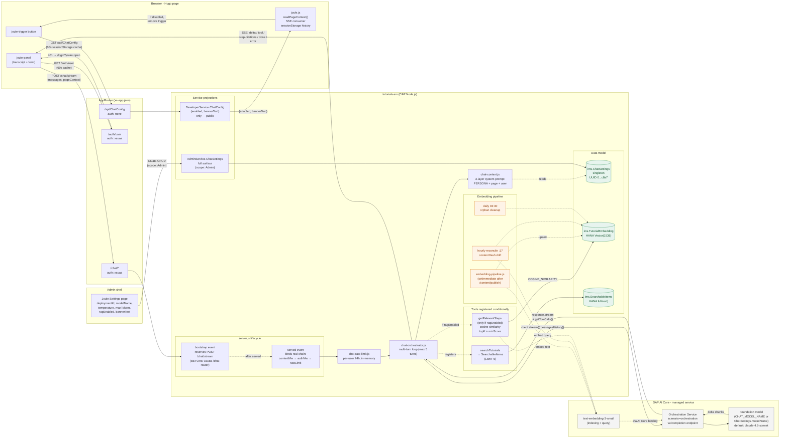

# SAP Tutorial Platform

A tutorial hosting platform for [developers.sap.com](https://developers.sap.com) that replaces both Adobe Experience Manager (AEM) and the legacy Java IMS backend. Fetches tutorial markdown from the [`sap-tutorials`](https://github.com/sap-tutorials) GitHub organization at build time, renders static pages with SAP Fundamental Styles (Horizon theme) via Hugo, and deploys on SAP BTP Cloud Foundry behind an AppRouter with XSUAA authentication. The CAP Node.js backend provides progress tracking, event management, and all services previously handled by the Spring Boot IMS application.

> **Production system** replacing AEM tutorial hosting, Git-based authoring interface, and Java IMS backend on developers.sap.com (April 2026).

**Stack:** Hugo &middot; CAP Node.js (CDS 9.x) &middot; SAP HANA Cloud &middot; SAP Fundamental Styles &middot; Vue 3 (apps) &middot; TypeScript &middot; SAP BTP Cloud Foundry

## Folder Map

```
tutorials-poc/
├── approuter/                  # BTP AppRouter — serves static files + proxies to CAP via XSUAA auth
│   ├── server.js               #   Custom AppRouter wrapper (VCAP merge, serve-static, proxy fixes)
│   ├── static/                 #   Pre-built assets deployed to CF
│   │   ├── admin-ui/           #     Admin shell (sap.tnt.ToolPage) + 11 Fiori Elements components
│   │   ├── analytics-ui/       #     Analytics Explorer Vue 3 SPA bundle
│   │   ├── scanner-ui/         #     UI5 barcode scanner bundle
│   │   ├── scanner-vue/        #     Vue 3 barcode scanner bundle
│   │   ├── display-app/        #     Display App SPA bundle (event monitor dashboard)
│   │   ├── qa/                 #     QA-channel Hugo build (gated by Tutorial.Author scope)
│   │   ├── css/img/js/         #     Global stylesheets, images, shared JS injected into Hugo pages
│   │   └── (no tutorials/)     #     Tutorials served dynamically from HANA, not static files
│   └── xs-app.json             #   Route definitions (/admin-ui, /analytics-ui, /scanner-*, /tutorials, /tutorials-qa, /api, /admin, /display, /chat, /search, /build, /content)
├── app/                        # Standalone UI applications (UI5 + Vue, deployed to approuter/static/)
│   ├── admin-shell/            #   sap.tnt.ToolPage shell with side navigation + theme switching
│   ├── admin/                  #   11 Fiori Elements feature components (events, missions, groups,
│   │                           #   accomplishments, prizes, tutorials, tags, operations, accounts,
│   │                           #   changelog, joule, feedback, analytics) loaded by the shell
│   ├── analytics-explorer/     #   Vue 3 + Vite + Monaco SQL editor over AnalyticsService
│   ├── scanner/                #   UI5 barcode scanner (sap.ndc.BarcodeScanner)
│   ├── display-app/            #   Standalone event monitor dashboard (Vue 3 + Vite, Socket.IO)
│   ├── admin-annotations.cds   #   @UI/@Common annotations for all admin screens
│   └── change-tracking.cds     #   @cap-js/change-tracking config for admin entities
├── hugo-apps/                  # Vue 3 page-level islands compiled into Hugo's static JS (output: hugo/static/js/)
│   └── src/                    #   9 entry points: navigator, app-space, event-display, nav-dropdown,
│       │                       #   scanner-vue, tutorial-feedback, tutorial-rating, cmd-palette, me
│       └── shared/             #   Shared utilities, API client, types
├── hugo/                       # Hugo static site generator — tutorial pages + layouts
│   ├── assets/css|js/          #   PostCSS pipeline (Fundamental Styles Horizon) + page-level JS
│   │                           #   includes ui5-bootstrap.ts (UI5 Web Components shellbar/dialog/etc.)
│   ├── config/                 #   Hugo configuration (hugo.toml, environment overrides)
│   ├── content/
│   │   ├── tutorials/          #     Generated tutorial markdown (gitignored, from fetch-tutorials)
│   │   ├── missions/           #     Generated mission overview pages
│   │   └── groups/             #     Generated completion-path pages
│   ├── data/                   #   Site-level data files (glossary, etc.)
│   ├── i18n/                   #   en_us only (developers.sap.com is English-only)
│   └── layouts/                #   _default, tutorials, missions, groups, partials, shortcodes
├── hugo.qa.toml                # Sibling Hugo config for QA channel (strips Joule FAB, rating, etc.)
├── preview-site/               # Hugo preview-site renderer (used by srv-qa preview path)
├── db/                         # Production CAP data model — CDS schema + HANA native artifacts
│   ├── schema.cds              #   Entity definitions (Users, Tutorials, Missions, Events, etc.)
│   ├── views.cds               #   CDS views (NavigatorCatalog, SearchableItems, CompletionAnalytics, …)
│   ├── persistence.cds         #   ContentFiles + ContentManifest (gzip-compressed tutorial BLOBs)
│   ├── audit-logging.cds       #   @PersonalData annotations (Users, UserMetaData, TaskRecords)
│   ├── change-tracking.cds     #   @cap-js/change-tracking annotations
│   ├── schema-ext.cds          #   Service-layer schema extensions
│   └── src/                    #   Native HANA artifacts (.hdbsequence for legacy integer IDs)
├── db-qa/                      # QA-channel HDI container schema (peer of db/, deploys to tutorials-hana-qa)
├── srv/                        # CAP Node.js backend — production services
│   ├── server.js               #   Bootstrap: registers Express routes + jobs on cds.on('served')
│   ├── *-service.cds + .js     #   9 services: developer, admin, analytics, exports, display,
│   │                           #     consolidation, scanner, search, chat, event-stream
│   ├── ord-annotations.cds     #   Open Resource Discovery registration for all services
│   ├── handlers/               #   Express route handlers (recommendations.js)
│   ├── exports/                #   ExportsService backends (CSV/zip, XLSX, task records, etc.)
│   ├── lib/                    #   Shared business logic (~40 modules):
│   │                           #     content-store (HANA BLOB serve), embedding-* (RAG), chat-* (Joule),
│   │                           #     accomplishment-evaluator, account-merge, build-catalog,
│   │                           #     navigator-catalog, recommend, co-completion, status-calculator,
│   │                           #     mail-client, ngds-client, adobe-analytics, qrcode-handler,
│   │                           #     analytics-sql-validator (SELECT-only allowlist for runSelectQuery),
│   │                           #     feedback-salt, ip-rate-limit, ttl-cache, pipeline-log, …
│   ├── jobs/                   #   Scheduled tasks: scheduler, account-merge, cleanup,
│   │                           #     ngds-retry, embedding-reconciliation, job-lock (distributed)
│   └── templates/notification/ #   Email HTML templates (Handlebars)
├── srv-qa/                     # QA-channel CAP app (peer of srv/, deploys to tutorials-srv-qa)
│   ├── server.js               #   Mounts xsuaa-scope-middleware (Tutorial.Author gate) + preview renderer
│   └── search-service.cds      #   QA-only search projection
├── scripts/                    # Build-time scripts — fetch, parse, publish, migrate, seed
│   ├── fetch-tutorials.ts      #   Main entry: fetches markdown from GitHub, generates Hugo pages
│   ├── publish-content.ts      #   Delta-publish Hugo HTML → HANA BLOBs via /content/publish
│   ├── parsers/                #   Markdown pipeline: v1 (legacy ACCORDION) + v2 (H3) + images,
│   │                           #     options, cap, github, rules, sanitize-html, hugo-delimiters, types
│   ├── grammars/               #   TextMate grammars for syntax highlighting
│   ├── highlight-cds.ts        #   CDS syntax highlighter
│   ├── install-qa-workflows.ts #   Distribute notify-qa.yml workflow to all -Contribution repos
│   ├── verify-qa-build.ts      #   Post-build verification of QA Hugo output
│   ├── check-qa-schema-drift.ts#   Compare prod vs QA HDI schemas (CI step)
│   ├── setup-dev-data.cjs      #   Slug population + autotest cleanup against DEV HANA
│   ├── seed-*.cjs / seed-*.js  #   Various data seeding scripts
│   ├── migrate-reference-data.js   # Export/import tutorials, missions, events from Java IMS
│   ├── migrate-user-progress.js    # Export/import user progress (paged, resumable)
│   ├── migrate-from-hana.js        # Direct HANA-to-HANA migration
│   └── compare-systems.js      #   Endpoint-by-endpoint diff between Java IMS and CAP
├── test/                       # Vitest workspaces (unit, hybrid, hybrid-qa, smoke)
│   ├── unit + integration/     #   In-memory SQLite, fast, no external deps (npm test)
│   ├── lib/ + jobs/ + parsers/ #   Module-level unit tests
│   ├── hybrid/                 #   Real HANA Cloud via cds bind --exec (npm run test:hybrid)
│   ├── hybrid-qa/              #   Hybrid tests against QA HDI
│   ├── smoke/                  #   HTTP smoke tests against deployed URLs (npm run test:smoke)
│   ├── srv-qa/                 #   QA-srv-specific tests (preview, scope middleware)
│   └── a11y/                   #   Accessibility tests
├── docs/                       # Architecture references and developer documentation
│   ├── pilot-status.md         #   Pilot completion + locked production scope
│   ├── testing-endpoints.md    #   Canonical UI + API endpoint reference (auth/scope mapping)
│   ├── production-ready.md     #   Go-live checklist
│   ├── theme-variants.md       #   Building event-specific theme variants (Joule, Sapphire, TechEd)
│   ├── qa-channel-bootstrap.md #   One-time QA author-preview channel setup
│   ├── author-instructions.md  #   Tutorial-author workflow
│   ├── content-pipeline.md     #   Fetch → parse → Hugo → HANA pipeline deep-dive
│   ├── authentication-architecture.md, mta-deployment.md, hugo-migration.md, ai-consumption.md, …
│   ├── improvements.md, TODO.md#   Feature backlog and gap tracking (largely historic)
│   └── superpowers/specs/+plans/ # Feature specs and step-by-step implementation plans
├── .deploy/                    # MTA build + deploy artifacts
│   ├── mta.yaml                #   MTA descriptor (modules: approuter, srv, srv-qa, db, db-qa, destinations)
│   ├── xs-security.json        #   XSUAA scopes + role collections (Admin, MobileApp, Tutorial.Author)
│   ├── deploy-admin.sh         #   Standalone admin UI deploy helper (bypasses MTA build)
│   └── DEPLOY.md               #   Deploy procedure documentation
├── deploy/                     # MTA extension descriptors (environment overrides)
│   ├── dev.mtaext              #   Development overrides (instance counts, memory)
│   ├── qa.mtaext               #   QA/staging overrides
│   └── prod.mtaext             #   Production overrides
├── .github/workflows/          # CI/CD pipelines (GitHub Actions)
│   ├── deploy.yml              #   Build MTA + deploy to BTP CF + post-deploy smoke tests
│   ├── rebuild-content.yml     #   Re-fetch tutorials + rebuild Hugo + publish HTML to HANA
│   ├── rebuild-content-qa.yml  #   QA-channel content rebuild (triggered by repository_dispatch)
│   ├── schema-drift-check.yml  #   Compare prod vs QA HDI schemas
│   └── notify-qa.yml.template  #   Template installed into every -Contribution repo
├── openspec/                   # OpenSpec change proposals + config
├── .tutorial-cache/            # Cached prod-channel GitHub markdown + metadata (gitignored)
├── .tutorial-cache-qa/         # Cached QA-channel markdown (gitignored, separate channel marker)
├── .migration-data/            # Migration export files from Java IMS (gitignored)
├── gen/                        # CDS build output (gitignored)
├── site/                       # Legacy VitePress output (deprecated, gitignored)
├── CLAUDE.md                   # Project context for Claude Code agents
├── AGENTS.md                   # Agent-specific instructions (Codex/Gemini parity)
├── package.json                # Root dependencies + npm scripts (full list: jq '.scripts' package.json)
└── vitest.config.ts            # Vitest workspace config (inline projects array)
```

## Quick Start

**Prerequisites:** Node.js >= 20, npm

```bash
npm install
npm run fetch-tutorials   # Fetch tutorial markdown from GitHub + CAP catalog
cds watch                 # Start CAP server (http://localhost:4004)
```

For the full static site build:

```bash
npm run dev               # Hugo dev server (requires fetch-tutorials first)
npm run build             # Production build → hugo/public/
```

## Scripts

Full list: `jq '.scripts' package.json`. The most operationally important ones:

### Setup

| Script | Description |
|--------|-------------|
| `npm install` | Install all dependencies |
| `npm run bind:setup` | First-time hybrid env binding (CAP + approuter against real HANA) |
| `npm run setup-dev-data` | Populate slugs + clean autotest data on DEV HANA (requires `cds bind`) |

### Dev

| Script | Description |
|--------|-------------|
| `cds watch` | Start CAP backend with in-memory SQLite (http://localhost:4004) |
| `npm run watch:hybrid` | CAP backend bound to real HANA via `--profile hybrid` |
| `npm run dev:hybrid` | CAP (hybrid) + approuter together — full local stack against real HANA |
| `npm run start:approuter` | Standalone approuter (port 5000) |
| `npm run dev` | Hugo dev server with live reload (requires `fetch-tutorials` first) |

### Build

| Script | Description |
|--------|-------------|
| `npm run fetch-tutorials` | Fetch markdown from GitHub, parse, generate Hugo content pages |
| `npm run discover-repos` | List discoverable tutorial repos without fetching |
| `npm run build:cds` | Production CDS build |
| `npm run build:css` | PostCSS pipeline for SAP Fundamental Styles |
| `npm run build:hugo` | Hugo static site build (minified) |
| `npm run build:apps` | Build `hugo-apps/` Vue islands into `hugo/static/js/` |
| `npm run build:admin` | Build admin-shell into `app/admin-shell/dist/` |
| `npm run build:analytics-explorer` | Build Analytics Explorer Vue 3 SPA |
| `npm run build:display` | Build Display App (event monitor dashboard) |
| `npm run build:highlight` | Generate CDS syntax highlighter assets |
| `npm run generate-dark-theme` | Regenerate dark-theme CSS variants |
| `npm run validate-tutorials` | Static validation of fetched tutorial markdown |
| `npm run build:all` | Full production pipeline (fetch + CSS + apps + Hugo + display) |

### Test

| Script | Description |
|--------|-------------|
| `npm test` | Unit tests (in-memory SQLite, fast) |
| `npm run test:watch` | Unit tests in watch mode |
| `npm run test:hybrid` | Hybrid tests against real HANA (requires `cf login` to DEV) |
| `npm run test:hybrid:watch` | Hybrid tests in watch mode |
| `npm run test:smoke` | HTTP smoke tests (set `SMOKE_BASE_URL` / `SMOKE_SRV_URL`) |
| `npm run test:a11y` | Accessibility tests |
| `npm run test:a11y:lighthouse` | Lighthouse a11y audit (lhci autorun) |
| `npm run test:a11y:summary` | Print a11y test summary |
| `npm run test:all` | All Vitest workspaces (unit + hybrid + smoke + a11y) |

### Content publishing

| Script | Description |
|--------|-------------|
| `npm run publish-content` | Delta-publish Hugo HTML → HANA BLOBs (use `-- --force` to bypass delta — required for prod) |

### QA channel (author preview)

| Script | Description |
|--------|-------------|
| `npm run fetch-tutorials:qa` | Fetch from `*-Contribution` repos only (cache: `.tutorial-cache-qa/`) |
| `npm run build:qa` | Hugo build with QA flag, post-build verify |
| `npm run publish-content:qa` | Force-publish to QA srv |
| `npm run qa:full` | End-to-end QA pipeline |

### Migration (Java IMS → CAP)

| Script | Description |
|--------|-------------|
| `npm run migrate:reference` | Export/import reference data from Java IMS |
| `npm run migrate:users` | Export/import user progress (paged, resumable) |
| `npm run migrate:hana` | Direct HANA-to-HANA migration |
| `npm run compare` | Compare Java IMS and CAP responses side-by-side |

## Environment Variables

Deploy-time variables for the MTA modules (CF env, role collections, secrets) are documented in [.deploy/DEPLOY.md](.deploy/DEPLOY.md). The tables below cover variables commonly set during local dev, CI, and migration.

### Build pipeline (fetch + publish)

| Variable | Required | Default | Description |
|----------|----------|---------|-------------|
| `GITHUB_TOKEN` | No | — | Avoids GitHub API rate limits when fetching tutorial markdown + commit metadata |
| `TUTORIALS_GITHUB_TOKEN` | No | — | CI-side alias for `GITHUB_TOKEN` (used by `deploy.yml`, `rebuild-content*.yml`) |
| `CAP_BASE_URL` | No | `http://localhost:4004` | CAP srv URL (build pipeline, `publish-content`, migration scripts) |
| `CAP_QA_BASE_URL` | No | — | QA-channel CAP srv URL for `publish-content:qa` |
| `CONTENT_API_KEY` | Yes (publish) | — | Bearer token for `POST /content/publish` and `/content/rollback` |
| `CONTENT_API_KEY_QA` | Yes (QA publish) | — | Bearer token for QA-channel `/content/publish` |
| `TUTORIAL_SLUG` | No | — | If set, `fetch-tutorials` busts the cache for that single slug; `rebuild-content.yml` skips the `RepoCatalog` upload |
| `INCLUDE_CONTRIBUTION_REPOS` | No | `false` | Include `*-Contribution` repos in fetch (prod channel only allows on opt-in) |
| `ONLY_CONTRIBUTION_REPOS` | No | `false` | QA channel: fetch from `*-Contribution` repos exclusively |

### CAP runtime (srv/)

| Variable | Required | Default | Description |
|---|---|---|---|
| `CONTENT_API_KEY` | Yes | — | Required to accept content publish writes; without it `/content/publish` returns 401 |
| `SUBMISSION_SALT_SECRET` | Yes (feedback) | — | IP-hash salt for `/feedback/submit`; bridge returns 503 if missing |
| `EXPOSE_CAP_UI` | No | `false` | Enables `/_dev` Swagger UI + CAP index page (DEV/QA only — never set in prod) |
| `CHAT_MODEL_NAME` | No | — | Override the Joule chat completion model |
| `SEARCH_RATE_LIMIT_MAX` | No | `60` | Per-IP search request limit per window |
| `SEARCH_RATE_LIMIT_WINDOW_MS` | No | `60000` | Search rate-limit window in ms |
| `DASHBOARD_URL` | No | Production URL | Tutorial Dashboard URL injected into notification emails |
| `SMTP_HOST` / `SMTP_PORT` / `SMTP_USER` / `SMTP_PASS` | No | — | SMTP transport for local email testing (e.g., MailHog) |

### Approuter (approuter/)

| Variable | Required | Default | Description |
|---|---|---|---|
| `REBUILD_API_KEY` | Yes (rebuild) | — | Bearer token for the approuter live-rebuild webhook |
| `CAP_BASE_URL` | No (CF: VCAP) | — | CAP srv URL for proxy fallback when running standalone |

### Testing

| Variable | Required | Default | Description |
|---|---|---|---|
| `SMOKE_BASE_URL` | Yes (smoke) | — | Approuter URL — `npm run test:smoke` target |
| `SMOKE_SRV_URL` | Yes (smoke) | — | CAP srv URL — `npm run test:smoke` target |
| `SMOKE_QA_BASE_URL` / `SMOKE_QA_SRV_URL` / `SMOKE_QA_TOKEN` | Yes (QA smoke) | — | QA-channel smoke-test endpoints + bearer |
| `SMOKE_ADMIN_TOKEN` | No | — | Bearer for admin-only smoke checks |
| `SMOKE_TECH_USER` / `SMOKE_TECH_PASSWORD` | No | — | Basic-auth credentials for tech-user smoke flow |
| `TECH_USERS` / `TECH_USERS_MAPPING` | No | — | Backend tech-user auth config consumed by smoke tests |
| `A11Y_BASE_URL` | Yes (a11y) | — | Target URL for `npm run test:a11y` |
| `ALLOW_HYBRID_WRITES` | No | `false` | Hybrid-test write guard — must be `true` to permit INSERT/UPDATE/DELETE |

### QA preview rendering (srv-qa/)

| Variable | Required | Default | Description |
|---|---|---|---|
| `PREVIEW_SITE_PATH` | No | bundled | Path to preview-site Hugo project |
| `PREVIEW_HUGO_BIN` | No | `hugo` | Hugo binary to invoke for preview renders |
| `PREVIEW_HUGO_ARGS_PREFIX` | No | — | Extra args prepended to every Hugo preview call |
| `PREVIEW_HUGO_TIMEOUT_MS` | No | — | Per-render timeout |
| `PREVIEW_MAX_CONCURRENT` | No | — | Max concurrent preview renders |
| `PREVIEW_QUEUE_TIMEOUT_MS` | No | — | Queue wait timeout before 503 |
| `SRV_URL_QA` | No | — | QA srv URL passed to preview renderer |

### Migration (legacy IMS cutover)

| Variable | Required | Default | Description |
|---|---|---|---|
| `IMS_BASE_URL` | Yes (migrate) | — | Legacy Java IMS approuter URL |
| `IMS_AUTH_TOKEN` | Yes (migrate) | — | Bearer token for Java IMS API |
| `IMS_DB_URL` / `IMS_DB_USERNAME` / `IMS_DB_PASSWORD` | Yes (HANA migrate) | — | Direct HANA creds for `migrate:hana` (IMSDBUSER schema) |
| `IMS_HANA_CREDENTIALS` / `CAP_HANA_CREDENTIALS` | No | — | Alternate JSON-form HANA credentials for migration |
| `MIGRATION_OUTPUT_DIR` | No | `.migration-data/` | Where migration export files are written |

## Runtime Architecture

See [docs/developers/architecture/runtime.md](docs/developers/architecture/runtime.md) for full details.

## Build Architecture

See [docs/developers/architecture/build.md](docs/developers/architecture/build.md) for full details.

## Joule Architecture

The in-page chat assistant on tutorial, mission, and search pages. Backed by SAP AI Core's **Orchestration Service** via [`@sap-ai-sdk/orchestration`](https://www.npmjs.com/package/@sap-ai-sdk/orchestration), with optional retrieval-augmented grounding over per-step tutorial embeddings.

Reference deep-dive: [docs/joule-chat.md](docs/joule-chat.md). Admin runbook: [docs/developers/operations/joule-chat-admin-settings.md](docs/developers/operations/joule-chat-admin-settings.md).



**Notes:**

- **Anonymous gating** — `GET /api/ChatConfig` is the *only* public endpoint in the chat path. It exposes `{ enabled, bannerText }` so the trigger button can decide whether to render without forcing a login on visitors who never click. `deploymentId`, `modelName`, `temperature`, `maxTokens`, and `maxRequestsPerUser` never leave the server.
- **Lifecycle quirk** — `POST /chat/stream` MUST be reserved on `cds.on('bootstrap')`, before CAP's OData router mounts `ChatService` at `/chat` (which would otherwise try to parse `stream` as a resource path → 404). The handler is a late-bound stub that gets replaced with the real `contextMw → authMw → rateLimit → businessHandler` chain on `served`. Requests arriving in between get `503 service_starting`.
- **Two-projection trust split** — `AdminService.ChatSettings` (full surface, scope `Admin`) drives the admin UI; `DeveloperService.ChatConfig` (3-field projection) is what the browser sees. Never widen the projection to `{ * }`.
- **Orchestration scenario, not model-direct** — `deploymentId` must point to a deployment created with **scenario `orchestration` + executable `orchestration`** in AI Launchpad. Model-direct deployments (Anthropic, Azure OpenAI direct) reject `v2/completion` with `400 BadRequest`.
- **BTP service dependencies** — `tutorials-srv` `requires:` four managed services for Joule (declared in [.deploy/mta.yaml](.deploy/mta.yaml)):
  - `tutorials-aicore` (`service: aicore`, plan `extended`) — provides the AI Core endpoint URL + OAuth client credentials. Marked `optional: true` so the MTA still deploys without it, but `/chat/stream` returns `503` until the binding exists. The `@sap-ai-sdk/orchestration` SDK reads credentials directly from `VCAP_SERVICES.aicore[0].credentials` — no manual env-var plumbing.
  - `tutorials-xsuaa` — `Admin` scope gates `AdminService.ChatSettings`; XSUAA `sub` claim is the rate-limiter bucket key.
  - `tutorials-hana` — persists `ChatSettings` (singleton row) and `TutorialEmbedding` (1,536-dim Vector column).
  - `tutorials-destination` — not used by Joule directly; required by other srv code paths but listed here for completeness since the Joule binding shares the same app instance.
- **AI Launchpad setup (one-time per subaccount)** — Joule needs **two** AI Core deployment UUIDs in `ChatSettings`:
  1. **Entitle + subscribe** — in BTP Cockpit, entitle the subaccount to **AI Core (`extended` plan)** and **AI Launchpad (`standard` plan)**, then subscribe to the AI Launchpad app and assign the `AI_Admin` role collection to yourself.
  2. **Resource group** — open AI Launchpad → select the AI Core instance bound to `tutorials-srv` → create or reuse a resource group (the default `default` works for single-tenant use).
  3. **Chat deployment** — *Generative AI Hub → Configurations → + Create* → Scenario `orchestration`, Executable `orchestration`, Version pinned, Save → open the configuration → Deploy → wait for status `RUNNING` → copy the deployment UUID. Paste into admin shell **Joule Settings → Deployment ID**.
  4. **Embedding deployment (only if `ragEnabled`)** — *Configurations → + Create* → Scenario `foundation-models`, Executable `azure-openai`, Model `text-embedding-3-small`, Save → Deploy → copy UUID. Paste into admin shell **Joule Settings → Embedding Deployment ID** and click **Seed Embeddings Now** for the first build (the hourly reconcile cron at `:17` catches subsequent drift).
  5. **Verify** — admin shell **Joule Settings → Test Connection** issues a one-shot `client.stream()` against the chat deployment; failure surfaces the upstream orchestration response body for diagnosis. See [docs/joule-chat.md](docs/joule-chat.md) "Diagnostic Recipe" for the canonical `cf logs` grep when this fails post-deploy.
- **Multi-turn tool loop** — capped at `MAX_TURNS = 5`. The model can invoke `searchTutorials` and (if `ragEnabled`) `getRelevantSteps` in any turn; the orchestrator runs the tool, pushes the result onto the message history, and re-streams.
- **RAG is conditional and async-fed** — `getRelevantSteps` only registers as a tool when `ChatSettings.ragEnabled` is true. Embeddings are populated by `setImmediate` after `POST /content/publish` (non-blocking), reconciled hourly at minute `:17` on `contentHash` drift, and cleaned daily at 03:30 for orphans. On HANA, queries use raw SQL with the `COSINE_SIMILARITY` operator; SQLite tests fall back to JS-side cosine.
- **Rate limiter is in-memory** — bucket key is the XSUAA `sub` claim. A `cf restart` resets every user's counter to zero, so the cap is best-effort, not a hard billing guard.
- **Default state is OFF** — `ChatSettings.enabled` defaults to `false` on first deploy. There is no env-var override; an admin must explicitly enable Joule via the admin shell.

## CAP Backend (srv/)

The CAP Node.js service is the complete replacement for the Java IMS Spring Boot application.

### Services

CDS `@requires` is the in-process gate; the AppRouter ([approuter/xs-app.json](approuter/xs-app.json)) adds additional XSUAA scope checks per route in front of `/api/*`, `/admin/*`, etc. — see [docs/developers/operations/testing-endpoints.md](docs/developers/operations/testing-endpoints.md) for the canonical route → scope mapping.

| Service | Path | `@requires` | Purpose |
|---------|------|-------------|---------|
| DeveloperService | `/api` | `any` | Tutorial progress, step completion, event progress, `ChatConfig` public projection, `getRelevantSteps` for non-RAG fallback |
| AdminService | `/admin` | `Admin` | Full CRUD over admin entities, GDPR anonymization, Joule settings (singleton), audit-log + change-tracking surface |
| AnalyticsService | `/admin/analytics` | `Admin` | Ad-hoc analytics — entity browser over `@analytics.exposed` views + `runSelectQuery` action (SELECT-only, allowlisted, `LIMIT 5001`) |
| ExportsService | `/admin/exports` | `Admin` | Long-running export jobs (CSV / Excel) for missions, accounts, completions |
| DisplayService | `/display` | `DisplayApp` | Event leaderboard, burnup charts, track stats — feeds the rotating event-monitor dashboard via Socket.IO events on the `/ws/display` namespace |
| ConsolidationService | `/api/v1` | `ConsolidationScope` | Account merge + legacy IMS endpoint compatibility for cutover-era integrations |
| ScannerService | `/scanner` | `authenticated-user` | UI5 barcode-scanner functions: `getContestant(accountNumber)`, `claimPrize(recordId)`. Approuter route additionally gates with scope `MobileApp` |
| SearchService | `/search` | `any` | `SearchableItems` HANA full-text projection — backs the global search bar, navigator, and Joule's `searchTutorials` tool |
| ChatService | `/chat` | `authenticated-user` | ORD-symmetric shell with no entities; the streaming work happens at `POST /chat/stream` (Express, registered in `bootstrap`) |
| EventStreamService | `event-stream` | `any` | WebSocket + REST event-stream feed for live tutorial-completion broadcasts |

The QA channel runs a parallel `tutorials-srv-qa` app (separate HDI container, separate slug-bytes URL) with its own service set focused on author-preview workflows: `ContentService` (preview, publish-to-QA), `SearchService` (QA-scoped), and the `POST /preview/render` endpoint consumed by the VSCode extension. All QA services require XSUAA scope `Tutorial.Author`. See [docs/developers/operations/qa-channel-bootstrap.md](docs/developers/operations/qa-channel-bootstrap.md).

### Built-in CAP Endpoints

CAP exposes additional routes that aren't defined in CDS but are useful (and dangerous) in production. The defaults in [srv/server.js](srv/server.js) lock these down — see lines 47-71 for the gate.

| Route | What it is | Production state |
|-------|-----------|------------------|
| `/` | CAP launchpad / welcome page (lists services + entities) | **Blocked** in production by an early-middleware 404 unless `EXPOSE_CAP_UI=true` |
| `/_dev/*` | Same launchpad surface for `cds watch`-style dev exploration | Approuter route gates with scope `Admin`; CAP only mounts it when `cds.env.server.index = true` (set by `EXPOSE_CAP_UI=true`) |
| `/$api-docs/*` | Swagger UI + OpenAPI 3 specs (one per service, with diagram) | Blocked by the same middleware. Only enabled when `EXPOSE_CAP_UI=true`; approuter route additionally requires scope `Admin` |
| `/<service-path>/$metadata` | OData v4 metadata document — exists for every CDS service automatically | Always available behind the service's normal auth (`@requires` + approuter scope) — relied on by Fiori Elements + the admin shell components |
| `/<service-path>/<EntitySet>` | OData v4 collection endpoints generated from `entity` / `view` declarations in each service `.cds` | Always available; auth follows the parent service |

`EXPOSE_CAP_UI` is intentionally NOT set on `tutorials-srv` in production. To temporarily enable the launchpad for debugging, set the env var on the live app, restart, and unset it when done:

```bash
cf set-env tutorials-srv EXPOSE_CAP_UI true && cf restart tutorials-srv
# … debug via /_dev under an Admin token …
cf unset-env tutorials-srv EXPOSE_CAP_UI && cf restart tutorials-srv
```

`tutorials-srv-qa` explicitly sets `EXPOSE_CAP_UI: false` in `mta.yaml` (see [.deploy/mta.yaml](.deploy/mta.yaml)) — the QA service must never expose the launchpad even by accident, since the QA HDI container holds in-flight author content.

### Custom Endpoints (Express)

Registered on `cds.on('bootstrap')` in [srv/server.js](srv/server.js) (a few in `served` once `cds.middlewares` is available). These run as raw Express routes — no OData parsing, no entity layer — and either bypass CAP's auth entirely (public probes, build-time data) or compose `context + auth` middleware manually.

A few are registered in `bootstrap` *specifically* to reserve the path before CAP's OData router mounts a service at the same prefix (`/admin/*`, `/chat/*`). Without that reservation OData would interpret the path as a resource and return `Invalid resource path` / `404`.

| Endpoint | Method | Auth | Purpose |
|----------|--------|------|---------|
| `/health` | GET | None | Liveness probe — always returns 200 + timestamp |
| `/health/db` | GET | None | Readiness probe — runs `SELECT 1 FROM DUMMY` against the bound HDI; returns 503 on connection error |
| `/auth/user` | GET | XSUAA | Returns `{ authenticated, id, email, givenName, familyName }` for the current IDP session — used by Joule and the admin shell to greet by first name |
| `/api/qrcode` | GET | XSUAA (via approuter) | Generates a per-tutorial QR PNG for the event-floor scanner UI |
| `/api/recommendations` | GET | XSUAA (via approuter) | Personalized "what's next" rail — blends embedding centroid + co-completion |
| `/build/catalog` | GET | None | Mission + group catalog for the static-site Hugo build |
| `/build/navigator` | GET | None | Side-nav tree (mission → group → tutorial) for the navigator Vue island |
| `/build/slug-mapping` | GET | None | Numeric-legacyId → slug map, used by migration + redirect tooling |
| `/build/co-completions` | GET | None | Co-completion graph used by `/api/recommendations` and admin analytics |
| `/build/repo-catalog` | GET | None | RepoCatalog snapshot — which slugs live in which `sap-tutorials/*` repo |
| `/build/repo-catalog` | POST | Bearer `CONTENT_API_KEY` | Authoritative writer; `rebuild-content.yml` posts after every full fetch |
| `/content/nav` | GET | None | Manifest navigation metadata for the active content version |
| `/content/hashes` | GET | None | `{ slug: sha256 }` map of currently-served tutorials — read by `publish-content.ts` for delta computation |
| `/content/tutorials/*slug` | GET | None (via approuter `/tutorials/*`) | Decompresses + serves tutorial HTML from HANA BLOBs with ETag + bounded LRU cache (50 MB) |
| `/content/publish` | POST | Bearer `CONTENT_API_KEY` | Accepts `{ trigger, hugoVersion, files: { slug: base64gzip } }` — creates a new manifest version and triggers async embedding pipeline via `setImmediate` |
| `/content/rollback` | POST | Bearer `CONTENT_API_KEY` | Reverts the active manifest to the previous version |
| `/feedback/submit` | POST | None (rate-limited, via approuter) | Bridge to `DeveloperService.submitTutorialFeedback` action — derives client IP from leftmost `X-Forwarded-For` and injects via `AsyncLocalStorage`. Requires `SUBMISSION_SALT_SECRET` or returns 503 |
| `/chat/stream` | POST | XSUAA + `authenticated-user` | Joule SSE streaming — reserved in `bootstrap` (before `ChatService` mounts at `/chat`); the late-bound dispatcher is replaced in `served` once `cds.middlewares` exists |
| `/admin/embeddings/stats` | GET | XSUAA + `Admin` | RAG embedding coverage stats for the Joule admin tile — reserved before `AdminService` OData router mounts at `/admin` |
| `/admin/analytics/*` | ALL | XSUAA + `Admin` | Reservation for the `AnalyticsService` OData adapter — without this, the `AdminService` OData router at `/admin` intercepts first and 404s |
| `/admin/exports/exportLegacyData` | GET | XSUAA + `Admin` | Streaming legacy-data export bridge — same OData-collision reservation pattern as the analytics path |

`/search` is a regular CDS service surface but is wrapped in `bootstrap` with a per-IP rate limiter ([srv/lib/ip-rate-limit.js](srv/lib/ip-rate-limit.js); 60 req/min default, tunable via `SEARCH_RATE_LIMIT_MAX` / `SEARCH_RATE_LIMIT_WINDOW_MS`).

For the canonical end-to-end smoke matrix (route → upstream service → expected response), see [docs/developers/operations/testing-endpoints.md](docs/developers/operations/testing-endpoints.md).

### WebSocket (Socket.IO)

Real-time event-floor dashboards subscribe to tutorial-completion events over a Socket.IO transport. Two CAP services expose the WS surface alongside their OData projections — see `@protocol: ['odata', 'websocket']` on [DisplayService](srv/display-service.cds#L3) (XSUAA `DisplayApp`, includes user name) and `@protocol: ['websocket', 'rest']` on [EventStreamService](srv/event-stream-service.cds#L1) (anonymous, kiosk-friendly, payload minus PII). Clients connect to Socket.IO namespaces `/ws/display` and `/ws/event-stream`; the underlying transport URL is `/socket.io/?EIO=4&transport=websocket`.

**Why Socket.IO, not raw WebSocket.**

- **Topic-based fan-out is built in.** Each event monitor subscribes only to its own event ID — the server filters automatically via the `contexts: [String(event.legacyId)]` argument to `cds.connect.to('DisplayService').emit(...)` (see [srv/developer-service.js:494](srv/developer-service.js#L494)). The CAP WebSocket plugin maps `contexts` onto Socket.IO rooms; with raw WS we'd reinvent the routing table by hand.
- **Reconnection, heartbeats, and transport fallback come for free.** `socket.io-client` (~30 KB minified) handles automatic reconnect, heartbeat ping/pong, and falls back from WebSocket to long-polling on locked-down networks — useful for kiosks behind corporate proxies.
- **Authenticated vs anonymous split is one config change, not a separate stack.** `DisplayService` is gated by XSUAA scope `DisplayApp`; `EventStreamService` is anonymous (`@requires: 'any'`) and emits the same payload minus PII. The handler in `developer-service.js` emits to both sequentially with the same `contexts:` filter.

**Implementation.** [`@cap-js-community/websocket`](https://www.npmjs.com/package/@cap-js-community/websocket) is the CAP plugin doing the WS plumbing — declaring `@protocol: 'websocket'` on a service is enough to mount the namespace; emitting a CDS `event` (e.g. `event tutorialCompleted { ... }` in the `.cds`) becomes a Socket.IO event on the corresponding namespace. The transport is selected via `"websocket": { "kind": "socket.io" }` in [package.json](package.json) (the plugin also supports `ws` and STOMP). No custom broker code lives in this repo — `socket.io@^4.8.0` runs in `tutorials-srv`, and `socket.io-client@^4.8.0` ships in [app/display-app/](app/display-app/) and the `event-display` / `app-space` islands in [hugo-apps/](hugo-apps/).

**Production access.** Approuter routes `^/socket\.io/` and `^/ws/` are wired with `authenticationType: 'none'` (see [approuter/xs-app.json](approuter/xs-app.json#L155-L168)) — the WS handshake itself bypasses approuter auth, and `DisplayService` enforces the `DisplayApp` scope at the CAP layer when a connection joins the `/ws/display` namespace.

### Scheduled Jobs

Registered via `cds.on('served')` in [srv/jobs/scheduler.js](srv/jobs/scheduler.js). Every job is wrapped in `runWithLock(name, durationMs, fn)` ([srv/jobs/job-lock.js](srv/jobs/job-lock.js)) — only one instance runs each tick across the CF app fleet. The pipeline log row created per run is queryable in the admin shell with a virtual `cfLogsUrl` jumping straight to the matching Cloud Logging window (±10s/+30s padding around the run).

| Cron | Job | Description |
|------|-----|-------------|
| `0 0 * * *` (00:00 daily) | `cleanup-step-failures` | Removes `StepFailure` rows older than 90 days |
| `0 1 * * *` (01:00 daily) | `account-merge-batch` | Processes scheduled account merges queued by `ConsolidationService` |
| `0 */2 * * *` (every 2h) | `ngds-retry` | Retries failed NGDS message deliveries |
| `0 3 * * *` (03:00 daily) | `content-gc` | Prunes `ContentFiles` versions in `SUPERSEDED` / `ROLLED_BACK` state older than 7 days, keeping the last 3 for rollback. Never touches `ACTIVE` or `PUBLISHING` |
| `15 3 * * *` (03:15 daily) | `pipeline-log-gc` | Prunes `PipelineLog` entries older than 30 days |
| `30 3 * * *` (03:30 daily) | `embedding-orphan-prune` | Deletes `TutorialEmbedding` rows for slugs no longer in the active manifest |
| `30 * * * *` (hourly :30) | `content-publishing-sweep` | Marks `PUBLISHING` manifests stuck > 60 min as `FAILED` (recovers crashed publishes) |
| `17 * * * *` (hourly :17) | `embedding-reconciliation` | Re-embeds tutorial steps whose `contentHash` drifted; offset to `:17` to dodge the `:00` thundering herd |
| `0 2 * * 0` (Sun 02:00 weekly) | `tutorial-metadata-review` | Self-healing backfill of any missing `TutorialMeta` rows (publish writes them inline; this catches drift) |
| `0 9 * * 1` (Mon 09:00 weekly) | `contributor-notifications` | Computes stale-tutorial notifications, resolves recipients (author + admin CC), sends escalating emails (180-day threshold) |
| `0 */4 * * *` (every 4h) | `email-retry` | Retries failed mail deliveries from the `MailQueue` |
| `0 0 2 1,7 *` (Jan 2 / Jul 2 00:00) | `tag-cleanup` | Removes unused `Tags` rows |

### Key Libraries (srv/lib/)

| File | Purpose |
|------|---------|
| `accomplishment-evaluator.js` | Evaluate badge/accomplishment rules against user progress |
| `account-merge.js` | Merge duplicate user accounts |
| `admin-analytics-runner.js` | Execute curated analytics queries against the allowlisted schema with PII guards |
| `admin-analytics-schema.js` | Allowlist of facts, dimensions, and PII denylist exposed via `AnalyticsService` |
| `admin-docs-index.js` | Load + search the prebuilt admin-docs index used by the Joule `searchAdminDocs` tool |
| `adobe-analytics.js` | Adobe Analytics XML beacon on tutorial completion |
| `analytics-sql-validator.cjs` | Parse + restrict ad-hoc SQL to SELECT-only against allowlisted tables (`runSelectQuery`) |
| `anonymization.js` | Build the operations descriptor to anonymize a user's personal data |
| `build-catalog.js` | Build pipeline data (missions, paths, tutorials) |
| `cf-logs-link.js` | Compose Cloud Logging dashboard URLs from the CF binding + app metadata |
| `chat-context.js` | Joule chat personas (learner + admin) and grounding rules for tool use |
| `chat-orchestrator.js` | Joule turn loop: orchestration client, tool definitions, multi-turn dispatch |
| `chat-rate-limit.js` | Per-user 24-hour sliding-window chat rate limiter |
| `co-completion.js` | Cached co-completion matrix ("learners who completed X also completed Y") |
| `content-store.js` | Tutorial HTML BLOB store: publish, manifest versioning, decompress + serve |
| `contributor-notifications.js` | Compute stale tutorials, escalation routing, config helpers |
| `embedding-client.js` | Azure OpenAI embedding client with batching + retry |
| `embedding-pipeline.js` | Compute + persist tutorial step embeddings (chunked, distributed-lock guarded) |
| `embedding-query.js` | Embed user query and rank steps by cosine similarity (RAG retrieval) |
| `embedding-stats.js` | Aggregate embedding coverage stats for `/admin/embeddings/stats` |
| `event-statistics.js` | Compute task-completion totals + unique users for an event |
| `export-helpers.js` | CSV formatting helpers (TaskRecords export, time-spent rendering) |
| `feedback-salt.js` | Daily-rotating HMAC salt for hashing feedback submitter IPs |
| `ip-rate-limit.js` | Per-IP fixed-window rate limiter for unauthenticated routes |
| `legacy-id.js` | HANA sequence-backed legacy integer IDs |
| `mail-client.js` | Nodemailer transport with BTP Mail binding, template rendering, retry |
| `navigator-catalog.js` | Cached `/build/navigator` handler reading the `NavigatorCatalog` entity |
| `ngds-client.js` | NGDS analytics integration with dead-letter retry |
| `pipeline-log.js` | Insert + complete `PipelineLog` rows for content + embedding pipeline runs |
| `qrcode-handler.js` | QR code PNG generation |
| `recommend.js` | Personalized "what's next" ranking blending embedding centroid + co-completion |
| `repo-catalog.js` | Serve `/build/repo-catalog` (`RepoCatalog` rows decoded into a slug → payload map) |
| `slug-mapping.js` | Build the legacyId → slug map for tutorials, missions, and completion paths |
| `status-calculator.js` | Tutorial + mission progress and status calculation from completion counts |
| `step-text-extractor.js` | Decompress tutorial HTML and extract per-step text (handles parser v1 + v2) |
| `tech-user-auth.js` | Basic-auth tech-user store loaded from `TECH_USERS` env, timing-safe compare |
| `ttl-cache.js` | Tiny in-memory TTL cache supporting sync values and Promise resolution |
| `tutorial-centroid.js` | Cached per-tutorial embedding centroid (averaged step vectors) |
| `tutorial-meta-init.js` | Backfill `TutorialMeta` rows for tutorials missing one (catches drift) |
| `user-progress.js` | Resolve XSUAA sub → `Users.ID` and supply progress data for chat tools |

### Data Model (db/) — prod HDI container `tutorials-hana`

Namespace: `com.sap.developers.ims`. Files split by purpose:

| File | Role |
| --- | --- |
| `db/schema.cds` | Entities, aspects (`TaskBase`, `LegacyKeyed`), enums (`MissionType`, `TaskType`, `TaskStatus`, `ExperienceLevel`) |
| `db/schema-ext.cds` | Extensions (`Missions.groupOrder`, `TaskBase.primaryTagRef`) + `@analytics.exposed` allowlist + `@Aggregation.ApplySupported` for the Analytics Explorer |
| `db/views.cds` | Read-only projections: `Tasks`, `NavigatorCatalog`, `SearchableItems`, `CompletionAnalytics`, `ActiveLearnersDaily`, `TutorialFeedbackAggregate` |
| `db/persistence.cds` | HANA storage hints (`@cds.persistence.exists`, table-type overrides) |
| `db/audit-logging.cds` | `@PersonalData` annotations on Users / UserMetaData / TaskRecords for `@cap-js/audit-logging` |
| `db/change-tracking.cds` | `@changelog` on `ChatSettings` (admin-mutable settings tracked via `@cap-js/change-tracking`) |

#### Core entities by concern

##### Identity & people

- **Users** — SAP IDP users (uuid, sapId, legacyId, email, names, avatarUrl)
- **UserMetaData** — per-user preferences (theme, notification opt-ins)
- **PrimaryAccounts / SecondaryAccounts / PrivacyProtectionActions** — account merge + GDPR anonymization audit

##### Learning content

- **Tutorials** — Tutorial metadata (slug, title, time, level, steps)
- **Missions** — Curated mission (slug, type: SEQUENTIAL/SET, groupOrder)
- **Groups** — Group of tutorials inside a mission
- **Steps / Checkpoints** — Step-level records used by progress tracking
- **CompletionPaths / CompletionPathItems / GroupPathItems** — Ordered tutorial→group→mission graph

##### Progress & rewards

- **TaskRecords** — User completion records (step, tutorial, group, mission, checkpoint)
- **AccomplishmentRecords / Accomplishments** — Earned badges and the catalog they reference
- **Events** — Time-boxed learning events (TechEd, Sapphire, Joule launches)
- **Prizes / PrizeRecords / FeaturedTasks** — Event prize pool, claimed records, hero-card promotions

##### Tagging

- **Tags / TutorialTags / GroupTags / MissionTags** — Many-to-many tag assignments (`primaryTagRef` provides value-help association)

##### Tutorial sourcing & freshness

- **TutorialContributors / TutorialRepositories** — GitHub authors and source repos
- **TutorialMeta** — Notification tracking (reviewed date, escalation level)
- **RepoCatalog** — Discovered-tutorial baseline (third-tier discovery fallback, written by CI)

##### Content persistence

- **ContentFiles** — Versioned, gzip-compressed Hugo HTML BLOBs (`slug + version` PK)
- **ContentManifest** — Publish manifest with status (`PUBLISHING / ACTIVE / SUPERSEDED / ROLLED_BACK`)
- **TutorialBodyText** — Plain-text projection of active HTML, refreshed on every publish (powers full-text search)

##### Embeddings & chat

- **TutorialEmbedding** — Per-step embedding vectors (HANA-only at query time; see Gotchas)
- **ChatSettings** — Joule chat config (model, RAG flag, system prompt) — change-tracked

##### Feedback

- **TutorialFeedback** — Per-tutorial NPS rating + comment (also rolled up by `TutorialFeedbackAggregate` view)

##### Operational & observability

- **ImsConfig** — Key-value configuration store (notification gates, email lists)
- **JobLocks** — Distributed lock rows for cron jobs
- **FailedEmails / StepFailures / NGDSFailedMessages** — Persistent failure queues
- **ActiveLearnerRecords / DashboardMonitoredRecords** — Live-event dashboard inputs
- **PipelineLog / PipelineLogItems / JobLogItems** — Structured job-execution log (surfaced via `cfLogsUrl` virtual)
- **DeveloperEnvironmentTabs / DeveloperEnvironmentLinks** — IDE quick-link metadata
- **TimeZones** — Reference table for event scheduling

### Data Model (db-qa/) — QA HDI container `tutorials-hana-qa`

The QA channel is a **separate HDI container** scoped to the `Tutorial.Author` XSUAA scope. It deploys from [db-qa/schema.cds](db-qa/schema.cds) under a distinct namespace `com.sap.developers.ims.qa` and is consumed by the `tutorials-srv-qa` MTA module — no foreign keys, queries, or replication touch the prod tables in [db/](db/).

The QA model is intentionally narrow — it persists **content + pipeline observability only**. There are no user, progress, event, prize, tag, embedding, or feedback tables, because authors preview rendered HTML, they do not generate progress.

| Entity | Role |
| --- | --- |
| `ContentFiles` | Versioned gzip-compressed Hugo HTML BLOBs (same shape as prod, isolated rows) |
| `ContentManifest` | QA publish manifest (`PUBLISHING / ACTIVE / SUPERSEDED / ROLLED_BACK`) |
| `TutorialBodyText` | Plain-text projection for QA full-text search |
| `Tutorials` | Minimal tutorial metadata for the QA navigator (slug, title, level, time) |
| `RepoCatalog` | Author-preview discovery baseline (sourced only from `*-Contribution` repos) |
| `JobLocks` | Per-container distributed locks for QA pipeline jobs |
| `PipelineLog / PipelineLogItems / JobLogItems` | QA pipeline execution log |

QA-channel guardrails:

- Fetch is gated by `ONLY_CONTRIBUTION_REPOS=true` so author drafts in `*-Contribution` repos never bleed into prod
- Publish requires `CONTENT_API_KEY_QA` (separate from prod `CONTENT_API_KEY`)
- Prod and QA schemas are kept aligned by the `.github/workflows/schema-drift-check.yml` workflow — any divergence in shared entity shapes fails CI

### Notification Escalation System

Tutorial contributors receive escalating email reminders when tutorials go 6+ months without review:

| Level | TO | CC | Message |
|-------|----|----|---------|
| 0 (First) | Tutorial owner/author | — | 90-day retirement warning |
| 1 (Second) | Tutorial owner/author | Repo owner | 60-day warning |
| 2 (Third) | Tutorial owner/author | Repo owner + admin list | 30-day warning |
| 3 (Final) | Admin list | — | Deadline passed, arrange removal |

Resend interval: 30 days between escalation levels. Controlled via `ImsConfig` entries `isNotificationSendingAllowed` and `emailListForOutdated`.

## Build Pipeline

See [docs/developers/architecture/build.md#build-pipeline](docs/developers/architecture/build.md#build-pipeline) for full details.

## Frontend Apps

The frontend lives in two trees with very different deploy mechanics.

- **`app/<name>/`** — five standalone applications, each with its own `package.json` and build, copied as a finished `dist/` (or `webapp/`) into `approuter/static/<route>/` at MTA-build time. Each is reachable at its own AppRouter path, with its own auth scope, and runs as a separate browser app.
- **`hugo-apps/src/<name>/`** — nine Vue 3 page-level islands compiled by a single Vite project into `hugo/static/js/*.js` and loaded by Hugo templates as `<script>` tags inside the static site. They share the Hugo page DOM rather than running as separate apps.

### Static site (Hugo)

`hugo/` produces the public tutorial site with SAP Fundamental Styles + UI5 Web Components (Horizon theme, light/dark via `data-theme`). Layouts in `hugo/layouts/`; tutorial pages use the Fiori Object Page layout via Hugo cascade. Tutorial HTML is **not** served from disk — see [Build Pipeline](#build-pipeline). The `hugo.qa.toml` sibling config drives the QA-channel build with author-preview UI stripped.

### app/ — standalone applications

| Path on AppRouter | Source | Stack | Auth |
| --- | --- | --- | --- |
| `/admin-ui/` | [app/admin-shell/](app/admin-shell/) + [app/admin/](app/admin/) | UI5 / `sap.tnt.ToolPage` shell + 13 Fiori Elements headless components | XSUAA + `Admin` |
| `/analytics-ui/` | [app/analytics-explorer/](app/analytics-explorer/) | Vue 3 + Vite + Monaco | XSUAA + `Admin` |
| `/display-app/` | [app/display-app/](app/display-app/) | Vue 3 + Vite, Socket.IO `/ws/display` | XSUAA |
| `/scanner-ui/` | [app/scanner/webapp/](app/scanner/webapp/) | UI5 (`sap.ndc.BarcodeScanner`) | XSUAA + `MobileApp` |

#### Admin shell + Fiori Elements components

- **`admin-shell/`** — `sap.tnt.ToolPage` with collapsible side navigation, theme switcher (light/dark/auto), Router-managed content area, and three custom views (Board, Statistics, TutorialDashboard) plus a Privacy view.
- **`admin/`** — 13 Fiori Elements apps loaded as headless components via `componentUsages`: `accomplishments`, `accounts`, `analytics`, `changelog`, `events`, `feedback`, `groups`, `joule`, `missions`, `operations`, `prizes`, `tags`, `tutorials`.
- All annotations live in [app/admin-annotations.cds](app/admin-annotations.cds); change-tracking annotations in [app/change-tracking.cds](app/change-tracking.cds).
- Theme persisted to `localStorage` key `sap-tutorials-admin-theme`, defaulting to OS preference.

#### Analytics Explorer

Vue 3 SPA over `AnalyticsService` (`/admin/analytics`). Two tabs:

- **Entity browser** — driven by the `@analytics.exposed` allowlist in [db/schema-ext.cds](db/schema-ext.cds); supports `$apply` (groupby + aggregate), filter, top, skip, orderby.
- **SQL** — Monaco editor (lazy-loaded) backed by the `runSelectQuery(sql)` action. Server-side validator (`srv/lib/analytics-sql-validator.cjs`): SELECT-only, allowlisted tables, no DDL/DML/multi-statement; every query is wrapped with `LIMIT 5001` to cap result size.

#### Display App

Standalone event-monitor dashboard for big screens. Five rotating views (Board, Statistics, Leaderboard, Burnup, Track Stats) auto-refresh; live updates arrive via Socket.IO on `/ws/display`. The `DisplayApp` scope is checked at namespace join, not at the AppRouter (which lets `^/socket\.io/` and `^/ws/` through unauthenticated).

#### Scanner

UI5 barcode scanner using `sap.ndc.BarcodeScanner` for device-camera scanning. Looks up a contestant by the account number encoded in their badge QR code via `getContestant(accountNumber)` (OData function on `ScannerService`), shows progress + prize info, and claims via `claimPrize(recordId)`. There's a Vue 3 sibling at `/scanner-vue/` — see below.

### hugo-apps/ — page-level Vue 3 islands

Compiled by `build:apps` (a single Vite project) into `hugo/static/js/<name>.js`. Each island mounts onto a Hugo-rendered DOM node when its host page loads.

| Island | Loaded on | Purpose |
| --- | --- | --- |
| `navigator` | `/` (homepage) | Tutorial navigator with filters and search |
| `app-space` | `/app-space` | Event-themed Vue SPA (Joule/Sapphire theme overlays); progress via `/api/getEventProgress`, QR via `/api/qrcode`, live updates via Socket.IO |
| `event-display` | `/event-display` | Launcher for the standalone display dashboard |
| `nav-dropdown` | All pages (header) | Mission/group dropdown in the shellbar |
| `scanner-vue` | `/scanner-vue/` | Vue 3 mobile-optimized scanner using native `BarcodeDetector`, falls back to manual JSON input |
| `tutorial-feedback` | Tutorial Object Pages | NPS rating + comment form, posts to `/feedback/submit` |
| `tutorial-rating` | Tutorial Object Pages | `ui5-rating-indicator` shipped with U6 |
| `cmd-palette` | All pages | ⌘K command palette (U4) |
| `me` | `/me/` | Profile + Recent Activity timeline (`ui5-timeline`, U17), reads `getMyCompletions` |

`hugo-apps/src/composables/` and `hugo-apps/src/shared/` hold cross-island utilities and are **not** themselves islands.

### UI features (U0–U18) on the static site

Beyond the islands above, the U0–U18 pilot shipped in-place enhancements rendered via Hugo partials + scoped JS modules in `hugo/assets/js/`:

- **Object Page layout** (U1), **Wizard step indicator** (U2), **Illustrated states** (U7), **Codetabs** (U8), **Glossary** (U9), **Toast + final-step CTA** (U10), **Reading-progress bar + scrollspy** (U11), **Reader mode** (U12), **Mermaid diagrams** (U13), **Skeleton loaders** (U14), **Lightbox** (U15), **Mission side-nav** (U16), **Mobile step sheet** (U18).

These are loaded via `hugo/assets/js/ui5-bootstrap.ts` (and tutorial-only modules via `hugo/assets/js/tutorial.ts`). Cross-page features that gate themselves on DOM presence belong in `ui5-bootstrap.ts` imports — `tutorial.ts` only loads on tutorial layouts.

## Deployment

Single MTA deployment to SAP BTP Cloud Foundry:

```bash
mbt build
cf deploy mta_archives/tutorials-poc_1.0.0.mtar
```

### MTA Modules

The deployment in [.deploy/mta.yaml](.deploy/mta.yaml) defines five modules — the prod and QA channels share an AppRouter and XSUAA instance but each gets its own srv app and HDI container.

| Module | Type | Source | Requires | Purpose |
| --- | --- | --- | --- | --- |
| `tutorials-db-deployer` | `hdb` | `gen/db` | `tutorials-hana` | Prod HANA schema + indexes (one-shot HDI deploy) |
| `tutorials-db-qa-deployer` | `hdb` | `gen/db-qa` | `tutorials-hana-qa` | QA HANA schema (peer of `db/`, namespace `com.sap.developers.ims.qa`) |
| `tutorials-srv` | `nodejs` | `gen/srv` | hana, xsuaa, destination, mail, audit-log, cloud-logging, aicore | CAP backend (9 services + jobs + Socket.IO + content store + RAG) |
| `tutorials-srv-qa` | `nodejs` | `gen/srv-qa` | hana-qa, xsuaa | QA-channel CAP srv (re-renders author drafts via `srv-qa/lib/parsers.bundle.mjs`) |
| `tutorials-approuter` | `approuter.nodejs` | `approuter/` | xsuaa, `srv-api` (destination), `srv-qa-api` (destination) | XSUAA login + static delivery + reverse proxy to both srv apps |

The AppRouter routes `^/tutorials-qa/(.*)`, `^/qa-search/(.*)` to the `srv-qa-api` destination and everything else (`/api/*`, `/admin/*`, `/display/*`, `/content/*`, etc.) to `srv-api`. WebSocket paths (`^/socket\.io/`, `^/ws/`) are `authenticationType: 'none'` because the scope check happens at namespace join.

### BTP Service Bindings

| Resource | Service / plan | Required by | Notes |
| --- | --- | --- | --- |
| `tutorials-hana` | `hana` / `hdi-shared` | `tutorials-srv`, `tutorials-db-deployer` | Prod HDI container (`com.sap.xs.hdi-container`) |
| `tutorials-hana-qa` | `hana` / `hdi-shared` | `tutorials-srv-qa`, `tutorials-db-qa-deployer` | QA-channel HDI container — separate from prod, no cross-foreign-keys |
| `tutorials-xsuaa` | `xsuaa` / `application` | all srv apps + approuter | Configured from [.deploy/xs-security.json](.deploy/xs-security.json) (Admin, MobileApp, DisplayApp, Tutorial.Author, ConsolidationScope, DeveloperApp scopes) |
| `tutorials-destination` | `destination` / `lite` | `tutorials-srv` | NGDS + SCI remote endpoints |
| `tutorials-mail` | `mail` / `standard` | `tutorials-srv` | SMTP for notification escalation emails |
| `tutorials-audit-log` | `auditlog` / `standard` (optional) | `tutorials-srv` | `@cap-js/audit-logging` sink for `@PersonalData` events |
| `tutorials-cloud-logging` | `cloud-logging` / `standard` (optional) | `tutorials-srv` | OTLP ingest enabled; backs the `cfLogsUrl` virtual on `PipelineLog` / `JobExecutionLog` |
| `tutorials-aicore` | `aicore` / `extended` (optional) | `tutorials-srv` | Backs `ChatService` + embeddings + RAG (`getRelevantSteps` tool) |

`optional: true` resources let `mbt build && cf deploy` succeed in a subaccount that hasn't entitled them yet (e.g., a fresh sandbox without AI Core). The srv app degrades gracefully when bindings are missing — chat returns 503, audit logging falls through to the console sink, OTLP export is no-op.

### Route Architecture

The AppRouter (`approuter/xs-app.json`) evaluates routes top-to-bottom on first match — so order matters. There are ~28 active routes; canonical reference for auth/scope per route is [docs/developers/operations/testing-endpoints.md](docs/developers/operations/testing-endpoints.md).

#### Static UIs (XSUAA + scope, served from `approuter/static/<route>/`)

| Pattern | Backed by | Auth |
| --- | --- | --- |
| `^/admin-ui/(.*)$` | `app/admin-shell/dist/` (TNT shell + 13 Fiori Elements components) | XSUAA + `Admin` |
| `^/analytics-ui/(.*)$` | `app/analytics-explorer/dist/` (Vue 3 + Monaco) | XSUAA + `Admin` |
| `^/scanner-ui/(.*)$` | `app/scanner/webapp/` (UI5 BarcodeScanner) | XSUAA + `MobileApp` |
| `^/scanner-vue/(.*)$` | `hugo-apps/src/scanner-vue/` island | XSUAA + `MobileApp` |

#### Authenticated API proxies (XSUAA + scope, → `srv-api` destination → `tutorials-srv`)

| Pattern | Service | Scope |
| --- | --- | --- |
| `^/admin/exports/(.*)$` | `ExportsService` | `Admin` |
| `^/admin/analytics/(.*)$` | `AnalyticsService` (gated entity surface + `runSelectQuery`) | `Admin` |
| `^/admin/(.*)$` | `AdminService` | `Admin` |
| `^/display/(.*)$` | `DisplayService` | `DisplayApp` |
| `^/api/v1/(.*)$` | `ConsolidationService` | `ConsolidationScope` |
| `^/api/(.*)$` | `DeveloperService` + `/api/qrcode`, `/api/recommendations` | XSUAA (any) |
| `^/chat/(.*)$` | `ChatService` + `/chat/stream` (SSE) | XSUAA (any) |
| `^/scanner/(.*)$` | `ScannerService` OData functions | XSUAA + `MobileApp` |
| `^/auth/user$` | Identity probe | XSUAA (any) |
| `^/login(\?.*)?$` | OAuth2 entry (XSUAA redirect) | XSUAA |

#### QA channel (XSUAA + `Tutorial.Author`, → `srv-qa-api` destination → `tutorials-srv-qa`)

| Pattern | Target on srv-qa | Notes |
| --- | --- | --- |
| `^/tutorials-qa/_nav\.json$` | `/content/nav` | QA-only navigation metadata |
| `^/tutorials-qa/search/?(.*)$` | static `/qa/search/$1` | search page shell from Hugo QA build |
| `^/qa-search/(.*)$` | `/search/$1` | QA-only `SearchService` proxy |
| `^/tutorials-qa/(.*)$` | `/content/tutorials/$1` | preview HTML from `tutorials-hana-qa` BLOBs |

#### Public / unauthenticated (no session required)

| Pattern | Purpose |
| --- | --- |
| `^/api/ChatConfig(.*)$` | Chat client bootstrap — config only, no PII |
| `^/search/(.*)$` | `SearchService` — public tutorial search |
| `^/content/(.*)$` | Tutorial HTML serve + `/content/hashes`, `/content/nav` (writes are bearer-token gated by `CONTENT_API_KEY` at the srv) |
| `^/build/(.*)$` | Build pipeline catalog/navigator/repo-catalog endpoints (CI consumers) |
| `^/feedback/(.*)$` | `/feedback/submit` (rate-limited, IP hashed via `SUBMISSION_SALT_SECRET`) |
| `^/health(/.*)?$` | Liveness + DB connectivity |
| `^/.well-known/(.*)$`, `^/ord/(.*)$` | ORD discovery |
| `^/rest/(.*)$` | Custom REST escape hatch (server-defined sub-routes) |
| `^/tutorials/_nav\.json$` → `/content/nav` | Prod navigation metadata |
| `^/tutorials/(.*)$` → `/content/tutorials/$1` | Prod HTML rewrite to HANA-backed serve |

#### WebSocket transport (auth: none at the router; scope enforced at namespace join)

| Pattern | Namespace | Scope check |
| --- | --- | --- |
| `^/socket\.io/(.*)$` | Socket.IO upgrade transport | (none — namespace-level) |
| `^/ws/(.*)$` | `/ws/display` | `DisplayApp` enforced inside `@cap-js-community/websocket` plugin |
| `^/ws/(.*)$` | `/ws/event-stream` | anonymous (kiosk monitors) |

The router is intentionally `authenticationType: "none"` for `^/socket\.io/` and `^/ws/` because the WebSocket plugin runs scope checks at namespace-join time — adding XSUAA at the router would force an OAuth dance the Socket.IO client can't complete cleanly. See [docs/authentication-primer.md](docs/authentication-primer.md) for the full token flow.

#### Catch-all (last)

`^/(.*)$` → `localDir: static/` (Hugo build output: homepage, `/tutorials/{slug}` shells, `/missions/{slug}`, `/groups/{slug}`, `/me/`, `/event-display/`, `/app-space/`, plus the compiled Vue islands in `hugo/static/js/`). `authenticationType: "none"` — public Hugo content with lazy login on demand.

## Data Migration

Migration scripts in `scripts/` support parallel operation during cutover from the Java IMS. Three migration paths cover the matrix of source-system access (REST API vs. direct HANA):

| Script | npm alias | Source → Target | Purpose |
| --- | --- | --- | --- |
| `migrate-reference-data.js export` | `npm run migrate:reference` | IMS REST → JSON file | Export tutorials, missions, groups, events, tags, accomplishments, prizes |
| `migrate-reference-data.js import` | `npm run migrate:reference` | JSON file → CAP | Import reference data into CAP HDI (idempotent on `legacyId`) |
| `migrate-reference-data.js populate-slugs` | — | `.migration-data/slug-mapping.json` → CAP | Backfill `Missions.slug` + `CompletionPaths.slug` after import (87 missions, 66 groups) |
| `migrate-user-progress.js export` | `npm run migrate:users` | IMS REST → JSON file | Paged + resumable export of users + task records |
| `migrate-user-progress.js import` | `npm run migrate:users` | JSON file → CAP | Idempotent re-import (uses `uuid`/`legacyId` for upsert) |
| `migrate-from-hana.js` | `npm run migrate:hana` | IMS HANA → CAP HANA | Direct HDI-to-HDI migration; bypasses the REST API for bulk + cross-instance moves |
| `compare-systems.js` | `npm run compare` | IMS vs. CAP REST | Endpoint-by-endpoint diff for cutover sign-off |

### `migrate-from-hana.js` source-credentials resolution (first match wins)

1. `IMS_HANA_CREDENTIALS` env var (full JSON: `host`, `port`, `user`, `password`, `schema`)
2. `IMS_DB_URL` + `IMS_DB_USERNAME` + `IMS_DB_PASSWORD` env vars (the shape returned by `cf env imsdev`)
3. `--source-instance=<name> --source-key=<name>` (resolved via `cf service-key`)

Useful flags: `--discover` (list source-schema tables, no writes), `--dry-run`, `--source-only`, `--entity=tutorials,users,…`.

### Environment

`IMS_BASE_URL`, `CAP_BASE_URL`, `IMS_AUTH_TOKEN` for the REST-based scripts; HANA env vars (above) for `migrate-from-hana.js`. Java IMS uses the `IMSDBUSER` schema (not the HDI schema) — see `cf env imsdev` for prod creds.

Export artifacts land in `.migration-data/` (gitignored). The same directory holds `slug-mapping.json`, which is **the canonical slug source for fresh DB deploys** — `scripts/setup-dev-data.cjs` consumes it via `npx cds bind --exec` to assign slugs to records that lack them. Per [CLAUDE.md](CLAUDE.md), the legacyId match is best-effort; a slug just needs to exist for `/build/catalog` to surface text slugs instead of numeric IDs.

## Testing

Five Vitest projects defined in [vitest.config.ts](vitest.config.ts) — each with its own include pattern, environment, and prerequisites:

| Project | Command | Backing store / target | Use |
| --- | --- | --- | --- |
| `unit` | `npm test` | In-memory SQLite (mock auth) | Default fast suite — pure-fn, parsers, CDS handlers, shared `srv/lib/` modules. Watch mode via `npm run test:watch` |
| `hybrid` | `npm run test:hybrid` | Real prod HDI via `cds bind --exec` | Schema deploy, HANA sequences, views, developer workflow, admin CRUD, search, vector round-trip, recommendations, audit/feedback. Requires `cf login` to DEV |
| `hybrid-qa` | `cds bind --exec -- npx vitest run --project hybrid-qa` | Real QA HDI (`hana-tutorials-db-qa`) | Author-channel parity tests; uses `pool: 'forks'` + `_guard.js` write protection |
| `smoke` | `npm run test:smoke` | Deployed approuter + srv over HTTP | Health, public endpoints, auth enforcement, OData metadata, content serve, search, WebSocket handshake, redirects, SEO/JSON-LD, QA routes. Set `SMOKE_BASE_URL` + `SMOKE_SRV_URL` |
| `a11y` | `npm run test:a11y` | Deployed approuter (Lighthouse CI) | WCAG smoke; full Lighthouse via `npm run test:a11y:lighthouse`, summary via `npm run test:a11y:summary` |

`npm run test:all` runs the full matrix under `cds bind --exec` (so hybrid + hybrid-qa get real bindings).

### Hybrid write safety

`test/hybrid/_guard.js` (and the `hybrid-qa` setup file) check `ALLOW_HYBRID_WRITES=true` before any INSERT/UPDATE/DELETE. Test data is prefixed with `__TEST__` and removed in `afterAll`. The guard exists because hybrid suites hit the same DEV HDI that powers the deployed app — a leaked write is a real write.

### Layout

- `test/unit/`, `test/lib/`, `test/jobs/`, `test/parsers/`, `test/integration/`, `test/srv-qa/` — picked up by `unit` (also pulls `srv/**/__tests__/`, `scripts/__tests__/`, and `app/analytics-explorer/src/**/__tests__/`)
- `test/hybrid/` — 17 hybrid suites
- `test/hybrid-qa/` — QA-channel parity
- `test/smoke/` — 26 smoke suites; CI runs them automatically after deploy via [.github/workflows/deploy.yml](.github/workflows/deploy.yml)
- `test/a11y/` — Lighthouse CI config + summary script
- `test/fixtures/` — Shared fixture data (no test files)

### Running a single file

```bash
npx vitest run test/lib/mail-client.test.js                 # one unit file
npx vitest run --project smoke test/smoke/health.test.js    # one smoke file
cds bind --exec -- npx vitest run test/hybrid/views.test.js # one hybrid file
```

## External Integrations

| System | Direction | Bound via | Purpose |
| --- | --- | --- | --- |
| GitHub `sap-tutorials` org (public) | Build-time | `GITHUB_TOKEN` (rate-limit avoidance) | Tutorial markdown source, discovered via `discoverAllTutorials()` |
| GitHub `*-Contribution` repos (private) | Build-time | `GITHUB_TOKEN` (required) | Validation quiz `rules.vr` files; QA channel content (`ONLY_CONTRIBUTION_REPOS=true`) |
| XSUAA / SAP IDP | Inbound | `tutorials-xsuaa` (`xsuaa/application`) | OAuth2 + JWT issuance; per-scope authorization (`Admin`, `MobileApp`, `DisplayApp`, `Tutorial.Author`, `ConsolidationScope`) |
| NGDS (legacy IMS analytics) | Outbound | `tutorials-destination` → `ngds` destination | `POST /ngds/developers/ims` on tutorial/accomplishment completion. Failed sends persisted in `NGDSFailedMessages`; `srv/jobs/ngds-retry.js` replays them with backoff |
| Adobe Analytics | Outbound | Direct fetch — no binding | XML beacon `event86` to `sap.d1.sc.omtrdc.net` (report suite `sapdeveloperdev`); see [srv/lib/adobe-analytics.js](srv/lib/adobe-analytics.js) |
| BTP Mail | Outbound | `tutorials-mail` (`mail/standard`) | Contributor + author notifications via `srv/lib/mail-client.js`; failed sends queued in `FailedEmails` |
| SAP AI Core | Outbound | `tutorials-aicore` (`aicore/extended`, optional) | Chat completions for `ChatService` + RAG; embedding generation for `TutorialEmbedding`. Degrades to 503 when unbound |
| SAP Audit Log | Outbound | `tutorials-audit-log` (`auditlog/standard`, optional) | `@PersonalData`-driven access/modification events on `Users`/`UserMetaData`/`TaskRecords`; falls back to console sink when unbound |
| SAP Cloud Logging | Outbound | `tutorials-cloud-logging` (`cloud-logging/standard`, optional, `ingest_otlp.enabled=true`) | OTLP export; backs `cfLogsUrl` virtual on `PipelineLog`/`JobExecutionLog`. No-ops when unbound |
| SAP Cloud Foundry API | Outbound | `cf` CLI inside `migrate-from-hana.js` | Resolves `cf service-key` for cross-instance HANA migration (cutover only) |

### Identity is JWT-only on CAP

The Java IMS calls SCI (SAP Cloud Identity) over HTTPS to enrich user profiles after JWT validation. CAP does **not** — `req.user.attr.email`/`given_name`/`family_name` come straight from the XSUAA JWT's `xs.user.attributes` claims, eliminating that network hop and the corresponding destination binding. SCI lookups remain in scope only for the `migrate-user-progress.js` script during cutover, which talks to Java IMS REST endpoints that still go through SCI on the Java side.

## Key Design Decisions

### Architecture

- **Tutorial HTML lives in HANA, not on disk.** Hugo builds HTML, `publish-content.ts` gzip-compresses + SHA-256-hashes per slug, then uploads only the changed slugs as BLOBs to `ContentFiles` + `ContentManifest`. AppRouter rewrites `/tutorials/{slug}` → `/content/tutorials/{slug}` on the srv, which decompresses and serves with ETag + bounded LRU. Consequence: `approuter/static/tutorials/` is explicitly removed during build — there is no static fallback. If nothing has been published, `/tutorials/*` returns 404.
- **QA channel is a parallel srv + HDI, not just a route flag.** `tutorials-srv-qa` binds to `tutorials-hana-qa`, runs the same handlers, and exposes preview content gated by the `Tutorial.Author` XSUAA scope. The router sends `/tutorials-qa/*` to the QA destination. Authors get prod-shaped previews with zero risk of cross-tenant data leakage; prod queries can never accidentally hit QA tables.
- **Public Hugo + lazy login.** The catch-all `/*` is `authenticationType: "none"` — anyone can read tutorials without an OAuth bounce. Login is triggered explicitly when the user clicks the profile icon (the `/login` route is the only authenticated GET on a non-API path). API calls under `/api/*` enforce XSUAA at the router and return 401 if the user hasn't signed in yet.
- **Optional service bindings degrade gracefully.** `tutorials-audit-log`, `tutorials-cloud-logging`, and `tutorials-aicore` are `optional: true` in the MTA. The srv detects missing bindings at boot: chat returns 503, audit logging falls through to the console sink, OTLP export is no-op. This makes `mbt build && cf deploy` succeed in fresh sandbox subaccounts that haven't been entitled to AI Core.
- **4-tier GitHub discovery resilience.** Live GitHub → on-disk cache → `RepoCatalog` baseline (HANA) → degrade. CI is the canonical writer of `RepoCatalog` — author pushes update the baseline so a GitHub outage at build time doesn't break the build.

### CAP runtime

- **`bootstrap` vs. `served` event split.** Custom Express routes (`/api/qrcode`, `/build/*`, `/feedback/*`, `/content/*`, `/auth/user`, `/health`, `/chat/stream`) register on `bootstrap` — before CDS auth middleware — so unauthenticated routes can opt out cleanly. Jobs and the Socket.IO plugin register on `served`, after entities and services exist.
- **Socket.IO via `@cap-js-community/websocket`, not raw WebSocket.** `@protocol: ['websocket', ...]` annotations on `DisplayService` + `EventStreamService` map CDS events to Socket.IO messages on `/ws/display` and `/ws/event-stream` namespaces. Scope check happens at namespace-join time (the router can't enforce XSUAA on a Socket.IO upgrade without breaking the handshake).
- **Never SELECT a HANA BLOB alongside metadata in one CDS QL query.** The LOB locator expires before the stream is consumed when mixed with non-BLOB columns. `srv/lib/content-store.js` and `srv/lib/embedding-query.js` use raw `db.run()` SQL on HANA and CDS QL on SQLite (unit tests). This is a HANA-only quirk that SQLite silently tolerates.
- **`AnalyticsService.runSelectQuery` is gated by allowlist + parser, not just `@requires`.** `srv/lib/analytics-sql-validator.cjs` rejects anything that isn't a single `SELECT` against the `@analytics.exposed` table set, then wraps with `LIMIT 5001` so a runaway query can't OOM the srv. The exposed entity surface for the `AnalyticsService` is governed by the same `@analytics.exposed` annotations on CDS views.

### Data + identity

- **JWT-only identity on CAP** (vs. the Java IMS's SCI lookup). User attributes come from `xs.user.attributes` on the XSUAA JWT — no synchronous network hop for profile enrichment. See [docs/authentication-primer.md](docs/authentication-primer.md).
- **`@PersonalData` + `@cap-js/audit-logging`** drives audit events on `Users`/`UserMetaData`/`TaskRecords` automatically. Plus a manual `SecurityEvent` on user anonymization. No hand-written audit calls.
- **`@changelog` + `@cap-js/change-tracking`** on admin-managed entities (Events, Missions, Groups, Accomplishments, Prizes, ImsConfig, FeaturedTasks, ChatSettings) for the changelog UI.
- **Legacy ID sequences (HANA `.hdbsequence`)** on every entity that exposes an integer ID to legacy IMS consumers. Used during parallel operation; remains a public contract until the cutover deprecation window closes.
- **Slug fields are required** for `Missions.slug` and `CompletionPaths.slug`, populated by `scripts/setup-dev-data.cjs` from `.migration-data/slug-mapping.json` after a fresh DB deploy. Without slugs, `/build/catalog` returns numeric IDs and Hugo cannot generate mission/group URLs.

### Operational defaults

- **`publish-content` always runs with `--force` in production.** Default delta detection silently drops slugs from the manifest because the server treats every publish as a full snapshot — `--force` bypasses delta and republishes the full set. (See [memory: publish-content needs --force](C:\Users\I809764\.claude\projects\d--projects-tutorials-poc\memory\feedback_publish_content_force.md).)
- **Daily content GC** at 03:00 prunes `SUPERSEDED`/`ROLLED_BACK` content versions older than 7 days (keeps 3 most recent for rollback). Never touches `ACTIVE` or `PUBLISHING`.
- **Notification toggle gates the scheduled job only.** The manual `sendContributorNotifications` admin action always sends regardless — operators need to be able to recover from a misconfigured cron without disabling and re-enabling the toggle.
- **`FailedEmails` + `NGDSFailedMessages` retry queues** keep the integration paths idempotent. Transport failures are persisted, not raised, so a missing SMTP in dev is graceful, not fatal. Retry job replays with exponential backoff.

## Documentation

A consolidated documentation site is planned for a later phase. Until then, reference docs live alongside the code in [docs/](docs/):

| Document | For |
| -------- | --- |
| [docs/author-instructions.md](docs/author-instructions.md) | Tutorial authors — frontmatter, step structure, local preview, publish flow |
| [docs/developers/architecture/build.md](docs/developers/architecture/build.md) | Engineers — full fetch → parse → Hugo → HANA pipeline with timing data |
| [docs/authentication-architecture.md](docs/authentication-architecture.md) | Engineers — XSUAA / IDP auth flow and component interactions |
| [docs/authentication-primer.md](docs/authentication-primer.md) | Engineers — high-level auth model intro |
| [docs/developers/operations/ias-setup.md](docs/developers/operations/ias-setup.md) | Operators — IAS migration configuration steps |
| [docs/historic/ims-api-reference.md](docs/historic/ims-api-reference.md) | Migration — legacy IMS Java API surface for parity reference |
| [docs/historic/ims-uncovered-features.md](docs/historic/ims-uncovered-features.md) | Migration — IMS features not yet ported to CAP |
| [docs/historic/hugo-migration.md](docs/historic/hugo-migration.md) | History — VitePress → Hugo migration rationale |
| [docs/developers/operations/mta-deployment.md](docs/developers/operations/mta-deployment.md) | Operators — MTA build/deploy procedures and troubleshooting |
| [docs/joule-chat.md](docs/joule-chat.md) | Engineers — Joule chat integration |
| [docs/developers/reference/ai-consumption.md](docs/developers/reference/ai-consumption.md) | Engineers — AI consumption surfaces |

## License

SAP Internal — Not for redistribution.
