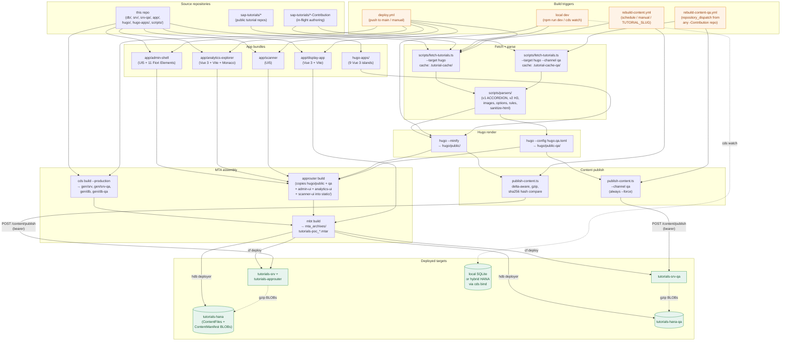

# Build Architecture and Content Pipeline

> Source: extracted from project README and merged with the former docs/content-pipeline.md, 2026-05-25.

## Build Architecture

How tutorial markdown becomes deployed HTML, and how code becomes deployed apps. Three independent trigger paths share the parser pipeline but write to different targets.



**Notes:**

- **Local dev** uses in-memory SQLite by default (`cds watch`); use `npm run dev:hybrid` for the full stack against real HANA via `cds bind`.
- **`deploy.yml` does NOT publish content** — it deploys the apps and HDI schemas. The post-deploy step triggers `rebuild-content.yml` to populate HANA. This separation lets content rebuilds run independently of code deploys (a single tutorial fix doesn't require redeploying the srv).
- **`rebuild-content.yml` honors `TUTORIAL_SLUG`** to bust the cache for one slug and skip the `RepoCatalog` upload — used by author-driven force-refresh.
- **QA channel** is end-to-end isolated: separate fetch cache (`.tutorial-cache-qa/`), separate Hugo config (`hugo.qa.toml`), separate srv (`tutorials-srv-qa`), separate HDI (`tutorials-hana-qa`), separate API key (`CONTENT_API_KEY_QA`). It never touches prod tables.
- **VSCode extension preview is in-process** — Hugo binary bundled into `tutorials-srv-qa`'s deploy artifact, shells out per request to render markdown into HTML using `preview-site/` layouts. No content is persisted; tmpdir is cleaned per call.

## Build Pipeline

Two parallel content pipelines feed two HDI containers. Both end at `POST /content/publish` on a CAP srv app — there is no static-file fallback for tutorial HTML.

### Prod pipeline → `tutorials-hana`

```
sap-tutorials GitHub repos (live discovery via discoverAllTutorials)
  ↓
scripts/fetch-tutorials.ts --target hugo            (cached in .tutorial-cache/)
  ├─ scripts/parsers/*                              parse frontmatter, steps, images, options
  ├─ fetchRulesVr() → .tutorial-cache/*.rules.vr    quiz data from *-Contribution repos
  └─ writes hugo/content/tutorials/*.md             (gitignored)

CAP_BASE_URL/build/catalog (unauth)
  ↓
hugo/content/missions/*.md, groups/*.md             mission + completion-path pages

build:css   → PostCSS Fundamental Styles → hugo/static/css/sap-fundamental.css
build:apps  → Vite bundles hugo-apps/ Vue 3 islands → hugo/static/js/*.js
              (navigator, app-space, event-display, nav-dropdown, scanner-vue,
               tutorial-feedback, tutorial-rating, cmd-palette, me)
build:highlight → syntax-highlights .cds samples

build:hugo  → hugo --minify → hugo/public/                       (full site, incl. tutorials/)
  ↓
scripts/publish-content.ts                          SHA-256 diff vs GET /content/hashes
  ↓                                                 gzip → base64 → POST /content/publish
                                                    (CONTENT_API_KEY bearer; --force to bypass delta)
CAP srv (tutorials-srv) /content/publish
  ↓
ContentFiles + ContentManifest BLOBs in tutorials-hana
  ↓
GET /tutorials/{slug}  →  approuter rewrites → /content/tutorials/{slug}
                          → decompress, ETag, bounded LRU cache (50MB)
```

> Tutorials are **explicitly removed** from `approuter/static/` during build (`rm -rf approuter/static/tutorials`). Hugo `public/tutorials/*` exists only as the source for `publish-content.ts`.

### QA channel pipeline → `tutorials-hana-qa`

Parallel author-preview track. Sources only `*-Contribution` repos, gated by XSUAA scope `Tutorial.Author`, never touches prod tables.

```
*-Contribution GitHub repos (ONLY_CONTRIBUTION_REPOS=true)
  ↓
fetch-tutorials:qa  → .tutorial-cache-qa/  (.channel marker prevents cross-contamination)
  ↓
build:qa  → hugo --config ../hugo.qa.toml → hugo/public-qa/
              (strips Joule FAB, rating, completion buttons, progress UI)
  ├─ verify-qa-build.ts  fails the build if QA-only stripping didn't apply
  ↓
publish-content:qa  (always --force; CONTENT_API_KEY_QA)
  ↓
tutorials-srv-qa /content/publish
  ↓
ContentFiles + ContentManifest in tutorials-hana-qa
  ↓
GET /tutorials-qa/{slug}  (XSUAA + Tutorial.Author at approuter)
```

QA srv re-renders tutorials at runtime using `srv-qa/lib/parsers.bundle.mjs`, produced by `prebuild:parsers-bundle` (esbuild ESM bundle of `scripts/parsers/`). This lets the QA srv accept author-pushed markdown without rebuilding Hugo per author.

### Standalone app builds

Each lives in its own subtree and copies a `dist/` (or `webapp/`) into the AppRouter's `static/<route>/` during MTA build:

| Source | Built by | Approuter path |
| --- | --- | --- |
| `app/admin-shell/` | `build:admin` | `static/admin-ui/` |
| `app/analytics-explorer/` | `build:analytics-explorer` | `static/analytics-ui/` |
| `app/display-app/` | `build:display` | `static/display-app/` |
| `app/scanner/webapp/` | (UI5 — copied directly) | `static/scanner-ui/` |
| `hugo-apps/scanner-vue` (island) | `build:apps` | `hugo/static/js/scanner-vue.js` (loaded as `<script>` from Hugo) |

### Build orchestration

`build:all` chains the pieces in order:

```
prebuild (parsers bundle)
  → fetch-tutorials --regenerate
  → build:css → build:apps → build:analytics-explorer
  → copy-joule-vendor → build:hugo → build:highlight → build:display
```

Admin shell (`build:admin`) and QA pipeline (`fetch-tutorials:qa` → `build:qa` → `publish-content:qa`) are not in `build:all` — they're run independently or via `qa:full` for the QA loop. Tutorials must be fetched at least once before `dev` or `build:hugo` (otherwise `hugo/content/tutorials/` is empty).

### Parsers (scripts/parsers/)

The fetch step (`scripts/fetch-tutorials.ts`) hands raw markdown + repo metadata to `composeTutorial()` (`compose.ts`), which orchestrates format detection, content transforms, and Hugo frontmatter emission. The same module set is bundled into `srv-qa/lib/parsers.bundle.mjs` (via `prebuild:parsers-bundle`) and re-used at runtime by the QA srv to render author-pushed drafts without re-running Hugo.

#### Format detection

| Parser | Detection | Delimiter |
| --- | --- | --- |
| `v2.ts` (current) | `parser: v2` in frontmatter | `###` (H3) headings = step titles |
| `v1.ts` (legacy) | Default | `[ACCORDION-BEGIN]` / `[ACCORDION-END]` markers |

Both produce the same in-memory `Tutorial` shape (`types.ts`) so downstream consumers don't branch on format.

#### Module map

| File | Role |
| --- | --- |
| `compose.ts` | Orchestrator — selects v1/v2, runs transforms, returns the rendered tutorial |
| `v1.ts` / `v2.ts` | Format-specific step splitters |
| `frontmatter.ts` | gray-matter wrapper, typed against `TutorialFrontmatter` |
| `frontmatter-utils.ts` | Tag humanization (preserves SAP/HANA/CAP/BTP/etc. acronyms), prerequisite list splitting |
| `render-frontmatter.ts` | Emits the YAML frontmatter Hugo consumes (escapes Hugo delimiters, formats tags) |
| `hugo-delimiters.ts` | Escapes `{{` / `}}` in tutorial source so Hugo doesn't interpret them as templates |
| `images.ts` | Rewrites relative image paths to `raw.githubusercontent.com` CDN URLs |
| `image-dimensions.ts` | Extracts width/height (cached on disk) so Hugo can emit `` size attrs and avoid layout shift |
| `options.ts` | Converts `[OPTION BEGIN]` / `[OPTION END]` blocks into Vue/Hugo shortcodes |
| `sanitize-html.ts` | Strips unsafe HTML embedded in tutorial source |
| `rules.ts` | Parses `rules.vr` quiz files (fetched from `*-Contribution` repos) into `ValidationQuestion` objects |
| `cap.ts` | Fetches mission/group catalog from `CAP_BASE_URL/build/catalog` for mission/group page generation |
| `github.ts` | `discoverAllTutorials()` + commit metadata; honors `EXCLUDED_REPOS` and `TUTORIAL_SLUG` for single-slug rebuilds |
| `recommendations.ts` | Computes related-tutorial suggestions from the catalog graph |
| `types.ts` | Shared TS types (`Tutorial`, `TutorialFrontmatter`, `Step`, `ValidationQuestion`, `TutorialNavEntry`) |
| `index.ts` | Re-exports for the QA-srv runtime bundle |
| `discovery-baseline.json` | Snapshot of `discoverAllTutorials()` output — third-tier discovery fallback when GitHub is unreachable |

#### Shared transforms (in compose order)

1. `frontmatter.ts` extracts YAML
2. v1/v2 splits the body into ordered steps
3. `images.ts` + `image-dimensions.ts` rewrite + size image references
4. `options.ts` converts option blocks
5. `sanitize-html.ts` strips unsafe HTML
6. `hugo-delimiters.ts` escapes `{{` / `}}`
7. `rules.ts` injects `ValidationQuestion[]` into the matching steps
8. `render-frontmatter.ts` emits the Hugo `.md` file

### Navigator Catalog (`GET /build/navigator`)

The navigator endpoint exposes tutorial reachability via three independent data paths, allowing front-ends to surface tutorials through missions, groups, or as standalone learnings.

| Data Path | Source | Mapping |
| --- | --- | --- |
| **Mission tutorials** | `NavigatorCatalog` SQL view + Mission `CompletionPathItems` where `taskType='TUTORIAL'` | Direct tutorial references inside mission completion paths |
| **Nested group tutorials** | Mission `CompletionPathItems` where `taskType='GROUP'` (JS-side expansion) | Handler expands nested Groups, pairs each tutorial with its parent mission + group |
| **Standalone groups** | `Groups.published=true` with no Mission link + `GroupPathItems` (JS-side scan) | Tutorials reachable through published Groups without a mission parent; emitted as `(group, tutorial)` pairs with `missionId=null` |

Response shape (top-level fields):

- **`missions[]`** — mission summary refs (existing)
- **`groups[]`** — Group refs including standalone published Groups
- **`tutorialMappings[]`** — array of `{ slug, missionId, missionTitle, missionSlug, groupId, groupTitle, groupSlug, order }` tuples (nullable mission fields for standalone tutorials)
- **`checkpointMappings[]`** — NEW — array of `{ title, missionId, missionTitle, missionSlug, pathId, pathSlug, itemOrder }` milestone markers from `CompletionPathItems` where `taskType='CHECKPOINT'` (currently consumer-side TODO for rendering)

Handler: [srv/lib/navigator-catalog.js](../../../srv/lib/navigator-catalog.js) — in-memory cache (5-minute TTL, auto-invalidated on AdminService writes to Missions, Groups, or CompletionPath* entities).

### Cache

Two parallel cache directories — one per channel — back the fetch step. Both are gitignored.

| Path | Channel | Source repos |
| --- | --- | --- |
| `.tutorial-cache/` | prod | All `sap-tutorials` repos minus `EXCLUDED_REPOS` |
| `.tutorial-cache-qa/` | QA | `*-Contribution` repos only (`ONLY_CONTRIBUTION_REPOS=true`) |

`.tutorial-cache-qa/` carries a `.channel` marker file. `npm run dev` warns if the cache content channel doesn't match the build target — switching channels without clearing the cache silently mixes prod and draft content.

#### Cache contents

| Artifact | Purpose | Invalidation |
| --- | --- | --- |
| `<slug>.md` | Raw tutorial markdown from GitHub | SHA mismatch via `<slug>.sha` |
| `<slug>.sha` | SHA-256 of the upstream `.md` for change detection | Replaced on each fetch |
| `<slug>.rules.vr` | Quiz validation rules (from `*-Contribution` repos via `fetchRulesVr()`) | SHA mismatch |
| `_discovery.json` | Output of `discoverAllTutorials()` — slug → repo + path map | Per-fetch refresh; falls back to `scripts/parsers/discovery-baseline.json` if GitHub unreachable |
| `cap-catalog.json` | `CAP_BASE_URL/build/catalog` snapshot (missions, completion paths) | 24h TTL (`CACHE_TTL_MS` in `parsers/cap.ts`) |
| `github-meta.json` / `github-meta.v2.json` | Commit author + timestamp metadata per slug | Per-fetch (rate-limited; honor `GITHUB_TOKEN`) |
| `image-dimensions.json` | Width/height for every referenced image (avoids layout shift) | Manual delete only — extraction is expensive |
| `errors.json` | Fetch error log (per slug, last attempt) | Overwritten per run |
| `_prod-tut.html` | Captured production HTML used for parser-output comparison | Manual |
| `quarantine/` | Tutorials that failed validation (`scripts/validate-tutorials.ts`) | Created on demand |

#### Invalidation

- Whole-cache reset: `rm -rf .tutorial-cache/` (or `.tutorial-cache-qa/`) — forces a full re-fetch from GitHub.
- Single slug: delete `<slug>.md` and `<slug>.sha`. The `rebuild-content.yml` workflow does this when an author dispatches the workflow with the optional `slug` input — it busts that one slug, regenerates the rest from cache, and skips the `RepoCatalog` baseline upload so the partial run doesn't overwrite it.
- Catalog only: delete `cap-catalog.json` to force a fresh CAP fetch before the 24h TTL expires.
- Images: delete `image-dimensions.json` only when image references change shape (rare).

## Detailed Content Pipeline


Complete flow of tutorial content from GitHub source to end-user delivery, including exception handling, versioning, and tracking.

### Pipeline Overview

```text
┌─────────────────────────────────────────────────────────────────────────┐
│                        CONTENT PIPELINE                                  │
├─────────────────────────────────────────────────────────────────────────┤
│                                                                          │
│  ┌──────────┐    ┌──────────┐    ┌──────────┐    ┌──────────────────┐  │
│  │  FETCH   │───▶│  PARSE   │───▶│  BUILD   │───▶│     PUBLISH      │  │
│  │ (GitHub) │    │ (MD→AST) │    │  (Hugo)  │    │ (Delta → HANA)   │  │
│  └──────────┘    └──────────┘    └──────────┘    └──────────────────┘  │
│       │                                                    │             │
│       ▼                                                    ▼             │
│  .tutorial-cache/                               ContentFiles (BLOB)      │
│  errors.json                                    ContentManifest          │
│                                                                          │
│                        ┌──────────────────┐                              │
│                        │      SERVE       │◀── LRU Cache (50MB)          │
│                        │ (Decompress+ETag)│                              │
│                        └──────────────────┘                              │
│                                 ▲                                        │
│                                 │                                        │
│                        AppRouter /tutorials/*                             │
└─────────────────────────────────────────────────────────────────────────┘
```

---

### Phase 1: Fetch (`scripts/fetch-tutorials.ts`)

Downloads tutorial markdown from the `sap-tutorials` GitHub organization.

### Steps

| Step | Action | Concurrency | Output |
|------|--------|-------------|--------|
| 1.1 | GraphQL discovery of repos | Sequential (paginated, 100/page) | `.tutorial-cache/_discovery.json` |
| 1.2 | Batch metadata prefetch | 3 repos × 20 tutorials/batch | `.tutorial-cache/github-meta.v2.json` |
| 1.3 | Download markdown | 5 concurrent tutorials | `.tutorial-cache/{slug}.md` + `.sha` |
| 1.4 | Parse & transform | Inline (per tutorial) | `hugo/content/tutorials/{slug}.md` |
| 1.5 | Fetch CAP catalog | Single request | `.tutorial-cache/cap-catalog.json` |
| 1.6 | Generate navigation | Inline | `hugo/content/tutorials/_nav.json` |

### Cache Strategy (SHA-based)

```text
For each tutorial slug:
  local_sha  = read .tutorial-cache/{slug}.sha
  remote_sha = latest commit SHA from GitHub

  if local_sha == remote_sha → use cached .md (status: "cached")
  if local_sha != remote_sha → re-fetch .md (status: "refreshed")
  if no local file           → fetch new   (status: "fetched")
```

Cache stored in `.tutorial-cache/` (gitignored). Delete directory to force full re-fetch.

### Exception Handling

| Failure | Scope | Behavior | Recovery |
|---------|-------|----------|----------|
| Markdown 404 | Single tutorial | Error thrown, caught | Logged to `errors.json`; pipeline continues |
| GitHub rate limit | Batch | Batch metadata fails | Fallback metadata applied (`{lastCommitSha: '', ...}`) |
| GraphQL errors | Discovery | Warnings logged | Continues with discovered repos |
| rules.vr fetch fail | Single tutorial | Returns null silently | Tutorial proceeds without quiz data |
| CAP catalog fail | All missions | Warning logged | Proceeds without mission/group assignments |
| Network timeout | Per request | Standard fetch rejection | Caught per-tutorial; logged |

### Error Tracking

Failed tutorials are written to `.tutorial-cache/errors.json`:

```json
[
  {
    "slug": "tutorial-slug",
    "repo": "sap-tutorials/repo-name",
    "error": "HTTP 404: Not Found",
    "timestamp": "2026-05-05T10:30:00.000Z"
  }
]
```

---

### Phase 2: Parse (`scripts/parsers/`)

Transforms raw markdown into Hugo-compatible content pages.

### Parser Selection

Determined by frontmatter field `parser: v2`:
- **V2** (current): H3 headings (`###`) delimit steps
- **V1** (legacy): `[ACCORDION-BEGIN]` / `[ACCORDION-END]` markers

### Transformations Applied

| Parser | File | Transformation |
|--------|------|----------------|
| Frontmatter | `parsers/frontmatter.ts` | Extract YAML metadata (title, level, tags, time) |
| Steps | `parsers/steps.ts` | Split into numbered steps with titles |
| Images | `parsers/images.ts` | Resolve relative paths → `raw.githubusercontent.com` CDN URLs |
| Options | `parsers/options.ts` | `[OPTION BEGIN]`/`[OPTION END]` → Hugo shortcodes |
| Rules | `parsers/rules.ts` | Parse `.rules.vr` quiz validation files |
| CAP | `parsers/cap.ts` | Inject mission/group metadata from build catalog |
| HTML | Inline | Escape dangerous HTML; preserve allowed tags |

### Safety: HTML Escaping

- HTML outside code fences is escaped (prevents XSS in rendered tutorials)
- Allowed tags preserved: `TutorialStep`, `OptionTabs`, `template`
- Component tag balancing: missing closing tags auto-added

---

### Phase 3: Build (Hugo)

Standard Hugo static site generation.

```bash
npm run build:hugo  # → hugo/public/tutorials/*/index.html
```

Output: One `index.html` per tutorial slug in `hugo/public/tutorials/`.

---

### Phase 4: Publish (`scripts/publish-content.ts`)

Delta-aware upload of changed tutorial HTML to SAP HANA Cloud.

### Delta Detection Algorithm

```text
1. Scan hugo/public/tutorials/ for index.html files
2. Compute SHA-256 hash of each local file
3. GET /content/hashes → { slug: remoteHash }
4. Compare:
   - slug in local but not remote     → NEW (publish)
   - local hash != remote hash        → MODIFIED (publish)
   - local hash == remote hash        → UNCHANGED (skip)
5. If /content/hashes unreachable     → publish ALL (fail-open)
```

### Payload Construction

For each changed slug:
1. Read HTML file
2. Gzip compress
3. Base64 encode
4. Include `__nav__` special entry (navigation metadata)

```text
POST /content/publish
Authorization: Bearer <CONTENT_API_KEY>
Content-Type: application/json

{
  "trigger": "ci@<commit-sha>",
  "hugoVersion": "0.139.0",
  "files": {
    "tutorial-slug-1": "<base64-gzipped-html>",
    "tutorial-slug-2": "<base64-gzipped-html>",
    "__nav__": "<base64-gzipped-json>"
  }
}
```

### CLI Flags

| Flag | Effect |
|------|--------|
| `--dry-run` | Show what would change without uploading |
| `--force` | Skip delta detection, republish all files |
| `--verbose` | Extra logging of hash comparisons |

### Exception Handling

| Failure | Behavior |
|---------|----------|
| `/content/hashes` returns 503 | Treat all files as changed (publish all) |
| Network error on POST | Script exits with non-zero code |
| 401 Unauthorized | Missing/wrong `CONTENT_API_KEY` |
| 409 Conflict | Another publish in progress (retry later) |

---

### Phase 5: Content Store (`srv/lib/content-store.js`)

Server-side persistence, versioning, and serving layer.

### Database Schema

```text
┌─────────────────────────────────┐    ┌───────────────────────────────────┐
│       ContentManifest            │    │          ContentFiles              │
├─────────────────────────────────┤    ├───────────────────────────────────┤
│ PK version: Integer              │    │ PK slug: String(255)              │
│    status: Enum                  │◀──▶│ PK version: Integer               │
│    trigger: String(500)          │    │    content: LargeBinary (gzip)    │
│    fileCount: Integer            │    │    contentHash: String(64)        │
│    totalSizeBytes: Int64         │    │    sizeBytes: Integer             │
│    changedSlugs: LargeString     │    │    compressedBytes: Integer       │
│    hugoVersion: String(20)       │    │    mimeType: String(100)          │
│    publishDurationMs: Integer    │    │    created_at: Timestamp          │
│    created_at: Timestamp         │    └───────────────────────────────────┘
│    updated_at: Timestamp         │
└─────────────────────────────────┘

ContentManifest.status:
  PUBLISHING  → in-progress write (transient)
  ACTIVE      → currently served to users
  SUPERSEDED  → replaced by newer version
  ROLLED_BACK → explicitly reverted
```

### Publish Handler (`POST /content/publish`)

```text
┌─ Acquire distributed lock (content-publish, 120s TTL) ─────────────────┐
│                                                                          │
│  1. Create manifest (status: PUBLISHING, version: max+1)                │
│  2. For each file in payload:                                            │
│     - Decode base64 → gzipped buffer                                    │
│     - Decompress → compute SHA-256                                       │
│     - Record: slug, version, content, hash, sizes                       │
│  3. Batch INSERT ContentFiles (groups of 50)                             │
│  4. Mark previous ACTIVE manifest → SUPERSEDED                          │
│  5. Update current manifest → ACTIVE + stats                            │
│  6. Invalidate LRU cache                                                 │
│  7. Log to PipelineLog                                                   │
│                                                                          │
└─ Release lock ──────────────────────────────────────────────────────────┘

Response 201:
{
  "version": 42,
  "filesWritten": 5,
  "totalSizeBytes": 1234567,
  "durationMs": 3200
}
```

### Concurrency Control

- **Distributed lock** via `JobLocks` table (expiry-based claiming)
- Lock key: `content-publish`
- TTL: 120 seconds (auto-expires if process crashes)
- Conflict response: `409 Conflict` with retry guidance

### Serve Handler (`GET /content/tutorials/:slug`)

```text
Request: GET /content/tutorials/abap-dev-create-table
         If-None-Match: "abc123..."

┌──────────────────────────────────────────────────────────┐
│ 1. Resolve active version from ContentManifest            │
│ 2. Check LRU cache (key: slug@version)                    │
│    ├─ HIT + ETag match → 304 Not Modified                │
│    ├─ HIT             → 200 (X-Content-Source: cache)    │
│    └─ MISS            → continue to DB                    │
│ 3. Query ContentFiles (slug + active version)             │
│    ├─ HANA: raw SQL (avoids LOB locator expiry bug)      │
│    └─ SQLite: CDS QL (unit tests)                        │
│ 4. Decompress gzip → HTML                                │
│ 5. Store in LRU cache                                     │
│ 6. Return 200 (X-Content-Source: db)                     │
│                                                           │
│ Headers:                                                  │
│   ETag: <contentHash>                                     │
│   Cache-Control: public, max-age=300                      │
│   Content-Type: text/html; charset=utf-8                  │
└──────────────────────────────────────────────────────────┘
```

### LRU Cache Details

| Parameter | Value |
|-----------|-------|
| Max size | 50 MB |
| Eviction | Least-recently-used |
| Invalidation | Full flush on publish or rollback |
| Key format | `{slug}@{version}` |

### HANA LOB Workaround

HANA BLOB columns return `Readable` streams with locators that expire before consumption when selected alongside non-BLOB columns in CDS QL. The content store uses **raw SQL** (`cds.run(sql)`) for BLOB retrieval on HANA, bypassing the CDS QL layer. SQLite (used in unit tests) uses standard CDS QL since it doesn't have this limitation.

---

### Phase 5.5: Embedding Hook (post-publish)

After the manifest goes `ACTIVE`, per-step embeddings are generated for RAG (Retrieval-Augmented Generation) in the Joule chat.

### Pipeline

```text
Hugo build → publish-content → /content/publish → manifest ACTIVE
                                                         ↓ setImmediate
                                                    embedSlugs(changed)
```

### Flow

1. **Immediate embed (non-blocking)** — After `POST /content/publish` completes and the manifest is marked `ACTIVE`, `srv/lib/content-store.js` schedules `embedSlugs(changedSlugs)` via `setImmediate`. The publish HTTP response returns immediately (201) without waiting for embeddings to complete.

2. **Hourly reconciliation** — A cron job at minute `:17` of every hour (`srv/jobs/embedding-reconciliation.js`, orchestrated in `srv/jobs/scheduler.js`) runs `runReconciliationJob`. It:
   - Re-embeds any step whose `contentHash` no longer matches the embedding row's stored `contentHash` (drift detection).
   - Embeds any rows in the active manifest that have no embedding yet.
   - Uses distributed locking via `runWithLock` (key: `embedding-reconciliation`, 30-minute timeout) for multi-instance safety.

3. **Daily orphan cleanup** — At 03:30 UTC, `srv/jobs/embedding-reconciliation.js` prunes embeddings for tutorials no longer in the active `ContentManifest`. This keeps the table bounded after content rollbacks or deletions.

All embeddings use the model specified in `ChatSettings.embeddingModel` (default: `text-embedding-3-small` via the `tutorials-aicore` AI Core destination).

---

### Phase 6: Rollback (`POST /content/rollback`)

Reverts to a previous content version without re-publishing.

```text
POST /content/rollback
Authorization: Bearer <CONTENT_API_KEY>
Body: { "targetVersion": 41 }  (optional — defaults to most recent SUPERSEDED)

Steps:
  1. Find target version (must be SUPERSEDED status)
  2. Current ACTIVE → ROLLED_BACK
  3. Target → ACTIVE
  4. Flush LRU cache
  5. Return new active version info
```

Rollback is instantaneous since all version data persists in `ContentFiles`.

---

### Phase 7: Garbage Collection (`srv/jobs/cleanup.js`)

Scheduled daily at 03:00 UTC by the job scheduler.

### Content Version Pruning

| Parameter | Default | Purpose |
|-----------|---------|---------|
| `keepCount` | 3 | Minimum superseded versions retained for rollback |
| `olderThanDays` | 7 | Only prune versions older than this |

```text
Candidates = ContentManifest WHERE
  status IN ('SUPERSEDED', 'ROLLED_BACK')
  AND created_at < (now - 7 days)

Candidates sorted by version DESC → skip first 3 (keepCount)
For remaining: DELETE ContentFiles + DELETE ContentManifest
```

**Safety**: Never touches `ACTIVE` or `PUBLISHING` manifests.

### Other Cleanup Tasks

| Task | Retention | Schedule |
|------|-----------|----------|
| Content version pruning | 3 versions / 7 days | Daily 03:00 |
| PipelineLog entries | 30 days | Daily 03:00 |
| StepFailures records | 90 days | Daily 03:00 |
| Unused tags | Immediate | Daily 03:00 |

---

### Tracking & Observability

### ContentManifest (Version History)

Each publish creates a manifest row tracking:
- Version number (monotonically increasing)
- Status lifecycle: `PUBLISHING → ACTIVE → SUPERSEDED`
- Trigger source (e.g., `ci@abc123`, `manual`)
- File count and total size
- List of all changed slugs (JSON array in `changedSlugs`)
- Hugo version used
- Server-side publish duration

### PipelineLog

Records all pipeline events (publishes, rollbacks) with timestamps, initiator, and outcome. Retained for 30 days.

### Response Headers (Serve)

| Header | Purpose |
|--------|---------|
| `X-Content-Source` | `cache` or `db` — indicates whether LRU cache was hit |
| `X-Content-Version` | Active manifest version number |
| `ETag` | SHA-256 hash of content (enables 304 responses) |
| `Cache-Control` | `public, max-age=300` (5-minute browser cache) |

### Error Surfaces

| Endpoint | Error | HTTP Code | Meaning |
|----------|-------|-----------|---------|
| `/content/publish` | Lock held | 409 | Another publish in progress |
| `/content/publish` | Bad token | 401 | Missing/invalid `CONTENT_API_KEY` |
| `/content/tutorials/:slug` | No active version | 503 | No content published yet |
| `/content/tutorials/:slug` | Slug not found | 404 | Tutorial not in active manifest |
| `/content/rollback` | No target | 404 | No SUPERSEDED version available |
| `/content/hashes` | No active version | 503 | No content published yet |

---

### End-to-End Flow (CI/CD)

```text
┌─ CI Pipeline ───────────────────────────────────────────────────────────┐
│                                                                          │
│  1. npm install                                                          │
│  2. npm run fetch-tutorials          ← GitHub → .tutorial-cache/        │
│  3. npm run build:all                ← Hugo → hugo/public/              │
│  4. npm run publish-content          ← Delta → HANA (ContentFiles)      │
│     └─ CONTENT_API_KEY required                                          │
│     └─ CAP_BASE_URL points to deployed srv                               │
│  5. npm run test:smoke               ← Verify /tutorials/* responds     │
│                                                                          │
└──────────────────────────────────────────────────────────────────────────┘
```

### Environment Variables

| Variable | Required By | Purpose |
|----------|-------------|---------|
| `GITHUB_TOKEN` | fetch | Avoid GitHub API rate limits |
| `CONTENT_API_KEY` | publish, rollback | Bearer token for write operations |
| `CAP_BASE_URL` | fetch (catalog), publish | Target CAP server URL |
| `SMOKE_BASE_URL` | smoke tests | AppRouter URL for integration tests |

---

### Performance Metrics

Based on recent runs (May 2026) against the full tutorial corpus of **1,378 tutorials** across **1,387 repos** in the `sap-tutorials` GitHub organization.

### Dataset Profile

| Metric | Value |
|--------|-------|
| Total tutorials discovered | 1,387 |
| Successfully processed | 1,378 |
| Parse errors (malformed frontmatter) | 8 |
| Raw markdown cache size | 14.2 MB |
| Avg markdown file size | 10.5 KB |
| Built HTML files | 2,509 (includes step sub-pages) |
| Total HTML output | 60.6 MB |
| Avg HTML file size | 24.7 KB |
| Largest HTML file | 298 KB |
| Median HTML file | 19.6 KB |
| Gzip compression ratio | ~78% |
| Estimated HANA storage (compressed) | ~22.6 MB |

### Phase 1: Fetch Timing

#### Cached Run (regenerate from local `.tutorial-cache/`)

| Phase | Duration | Notes |
|-------|----------|-------|
| Discovery (GraphQL) | 0 ms | Skipped in `--regenerate` mode |
| Metadata prefetch | 0 ms | Skipped in `--regenerate` mode |
| Tutorial processing | 3.1 s | Parse + Hugo page generation |
| CAP missions/groups | 123 ms | Catalog fetch (0 missions if CAP not running) |
| **Total** | **3.2 s** | |

#### Per-Tutorial Stats (cached)

| Metric | Value |
|--------|-------|
| Average | 7 ms/tutorial |
| Slowest | 18 ms |
| Fastest | 3 ms |
| Throughput | 426.6 tutorials/sec |

#### Cold Run (fresh fetch from GitHub)

Estimated from concurrency settings and network characteristics:

| Phase | Estimated Duration | Notes |
|-------|-------------------|-------|
| Discovery (GraphQL) | 3–5 s | Paginated, ~14 pages × 100 repos |
| Metadata prefetch | 15–30 s | 3 concurrent repos × 20 tutorials/batch |
| Tutorial download | 60–90 s | 5 concurrent, ~1,378 fetches from `raw.githubusercontent.com` |
| Tutorial processing | 3–5 s | CPU-bound parsing (same as cached) |
| CAP missions/groups | 0.5–2 s | Single HTTP request to catalog endpoint |
| **Total (cold)** | **~90–130 s** | Dominated by GitHub API/network time |

GitHub rate limit: 5,000 requests/hour with `GITHUB_TOKEN`; unauthenticated: 60/hour (will fail for full corpus).

### Phase 3: Hugo Build

| Metric | Value |
|--------|-------|
| Input pages | ~2,500+ (tutorials + missions + groups + static) |
| Output size | 70 MB (full `hugo/public/`) |
| Typical build time | 5–10 s |
| Build command | `hugo --minify` |

### Phase 4: Publish Timing

#### Delta Publish (typical CI — 1–10 changed files)

| Step | Duration | Notes |
|------|----------|-------|
| Local hash computation | < 500 ms | SHA-256 of 2,509 files |
| Remote hash fetch (`GET /content/hashes`) | 200–500 ms | Network to BTP + HANA query |
| Delta calculation | < 10 ms | In-memory comparison |
| Gzip + base64 encoding | < 100 ms | For changed files only |
| Network upload | 200–1,000 ms | Payload typically < 1 MB |
| Server-side persist | 500–2,000 ms | Decompress, hash, batch INSERT, manifest update |
| **Total (delta)** | **~2–4 s** | |

#### Full Publish (all 2,509 files, `--force`)

| Step | Duration | Notes |
|------|----------|-------|
| Gzip + base64 encoding | 2–3 s | All 2,509 files |
| Payload size | ~25 MB | Compressed + base64 overhead |
| Network upload | 5–15 s | Depends on bandwidth to BTP region |
| Server-side persist | 10–30 s | 50 files/batch × ~50 batches, plus SHA-256 per file |
| **Total (full)** | **~20–50 s** | |

Server-side `publishDurationMs` (recorded in `ContentManifest`) excludes network transfer — measures only DB writes and hash computation.

### Phase 5: Content Serving

| Scenario | Response Time | Notes |
|----------|---------------|-------|
| LRU cache hit + ETag match | < 1 ms | Returns 304 immediately |
| LRU cache hit (no ETag) | 1–2 ms | Returns decompressed buffer |
| Cache miss (HANA query) | 20–80 ms | Raw SQL BLOB fetch + gunzip |
| Cold start (first request) | 50–150 ms | No cache populated yet |

#### Cache Warm-Up Behavior

After a CAP srv restart, the LRU cache is empty. First ~50 unique tutorial requests populate the cache. At steady state with the 50 MB limit:

| Metric | Value |
|--------|-------|
| Cache capacity | ~2,000 tutorials (at 24.7 KB avg) |
| Coverage | ~80% of corpus fits in cache |
| Eviction | LRU — rarely-accessed tutorials evicted first |
| Hit rate (steady state) | 90–95% (typical usage patterns favor popular tutorials) |

### Garbage Collection

| Operation | Duration | Frequency |
|-----------|----------|-----------|
| Content version pruning | 1–5 s | Daily 03:00 |
| PipelineLog cleanup | < 1 s | Daily 03:00 |
| StepFailures cleanup | < 1 s | Daily 03:00 |
| Unused tags cleanup | < 1 s | Daily 03:00 |

### End-to-End Pipeline (CI)

| Stage | Cached | Cold |
|-------|--------|------|
| `npm install` | 10–20 s | 30–60 s |
| `npm run fetch-tutorials` | **3 s** | **90–130 s** |
| `npm run build:all` | 15–25 s | 15–25 s |
| `npm run publish-content` | **2–4 s** | (first deploy: 20–50 s) |
| `npm run test:smoke` | 5–10 s | 5–10 s |
| **Total CI (cached)** | **~40–60 s** | |
| **Total CI (cold)** | | **~3–5 min** |

### Bottlenecks & Scaling Notes

| Concern | Current State | Mitigation |
|---------|---------------|------------|
| GitHub API rate limit | 1,378 fetches fit in 5,000/hr budget | SHA-based cache prevents re-fetch |
| Payload size (full publish) | ~25 MB JSON | Delta detection reduces to < 1 MB typical |
| HANA BLOB insert | 50 files/batch to avoid tx size limits | Parallel batches not used (sequential) |
| LRU cache cold start | ~50 requests to warm popular content | Pre-warm could be added but not needed |
| Hugo build time | Linear with page count | Already fast (< 10 s for 2,500 pages) |

---

### Request Routing (Production)

```text
Browser → AppRouter (xs-app.json)
  /tutorials/(.*)  →  rewrite to /content/tutorials/$1  →  CAP srv
                                                              │
                                                              ▼
                                                    content-store.js
                                                              │
                                                    ┌─────────┴─────────┐
                                                    │   LRU Cache Hit?   │
                                                    └─────────┬─────────┘
                                                         yes / no
                                                        /       \
                                                   200          HANA query
                                                              (raw SQL)
                                                                │
                                                            decompress
                                                                │
                                                            200 + cache
```

Tutorial HTML is served exclusively from HANA BLOBs. There is no static file fallback — if no content has been published, `/tutorials/*` returns 404.

---

### Resilience: AppRouter Restage / Filesystem Loss

Cloud Foundry containers are ephemeral — a restage, restart, or crash recovery destroys the local filesystem. This section documents the impact on content serving.

### What the AppRouter filesystem contains

The AppRouter's `approuter/static/` directory holds:
- Hugo-built static assets (CSS, JS, images, landing pages)
- **NOT tutorials** — explicitly removed during build (`rm -rf approuter/static/tutorials`)

### What happens on restage

```text
┌─ AppRouter restaged ────────────────────────────────────────────────────┐
│                                                                          │
│  Lost:                                                                   │
│    • Static assets (CSS, JS, images)                                    │
│    • Landing pages, mission pages, group pages                          │
│                                                                          │
│  NOT lost (never on filesystem):                                         │
│    • Tutorial HTML content (lives in HANA)                              │
│    • Content manifests and version history (HANA)                       │
│    • Navigation metadata (HANA)                                          │
│                                                                          │
│  Temporarily lost (rebuilt on first request):                            │
│    • CAP srv in-memory LRU cache (50MB) — cold start, repopulates      │
│                                                                          │
└──────────────────────────────────────────────────────────────────────────┘
```

### Impact by component

| Component | Storage | Restage Impact | Recovery |
|-----------|---------|----------------|----------|
| Tutorial HTML | HANA BLOBs | **None** — never on AppRouter filesystem | Immediate |
| Content versions | HANA (ContentManifest) | **None** | Immediate |
| LRU cache (CAP srv) | In-memory (srv process) | Lost if srv also restaged | Auto-rebuilds on requests |
| Static assets (CSS/JS) | AppRouter filesystem | **Lost** — must redeploy | MTA deploy restores from build artifact |
| Hugo landing pages | AppRouter filesystem | **Lost** — must redeploy | MTA deploy restores from build artifact |

### Why tutorials survive

The architectural decision to store tutorials in HANA rather than as static files was made specifically for this reason:

1. **Decoupled lifecycle** — Content publishes independently of app deploys. A new tutorial can go live without redeploying the AppRouter.
2. **Restage-proof** — CF container recreation doesn't affect content availability. The AppRouter is a stateless proxy for `/tutorials/*`.
3. **Rollback without redeploy** — `POST /content/rollback` reverts content instantly without touching CF at all.

### The request path after restage

```text
Browser: GET /tutorials/abap-dev-create-table

AppRouter (freshly restaged, empty filesystem):
  1. xs-app.json route: /tutorials/(.*) → destination "srv-api", path /content/tutorials/$1
  2. AppRouter does NOT look for /tutorials/ on its own filesystem
  3. Proxies to CAP srv

CAP srv:
  4. content-store.js resolves active ContentManifest version
  5. LRU cache miss (cold start) → query HANA
  6. Decompress BLOB → return HTML
  7. Populate LRU cache for subsequent requests

Result: 200 OK — user sees tutorial content as normal
```

### Recovery scenarios

| Scenario | Tutorial Content | Static Assets | Action Required |
|----------|-----------------|---------------|-----------------|
| AppRouter restage only | Unaffected | Lost | Redeploy MTA (or just approuter module) |
| CAP srv restage only | Unaffected (HANA) | Unaffected | None — LRU cache rebuilds automatically |
| Both restaged | Unaffected (HANA) | Lost | Redeploy MTA |
| HANA Cloud restart | Temporarily unavailable | Unaffected | Wait for HANA recovery; content intact |
| Full MTA redeploy | Unaffected (HANA) | Restored from build | None |

### Edge case: First deploy (no content in HANA)

If the AppRouter is deployed before any content has been published to HANA, `/tutorials/*` returns 404. This is the expected "empty state." Run `npm run publish-content` against the deployed CAP srv to populate content.
