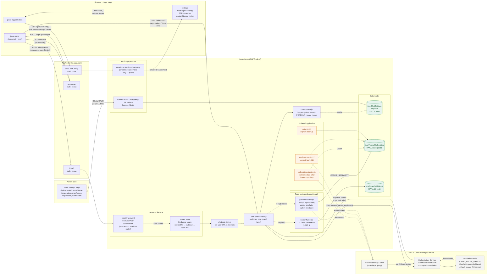

# Joule Chat Architecture

> Source: extracted from project README and merged with the former docs/joule-chat.md, 2026-05-25.

## Architecture

The in-page chat assistant on tutorial, mission, and search pages. Backed by SAP AI Core's **Orchestration Service** via [`@sap-ai-sdk/orchestration`](https://www.npmjs.com/package/@sap-ai-sdk/orchestration), with optional retrieval-augmented grounding over per-step tutorial embeddings.

Admin runbook: [../operations/joule-chat-admin-settings.md](../operations/joule-chat-admin-settings.md).



**Notes:**

- **Anonymous gating** — `GET /api/ChatConfig` is the *only* public endpoint in the chat path. It exposes `{ enabled, bannerText }` so the trigger button can decide whether to render without forcing a login on visitors who never click. `deploymentId`, `modelName`, `temperature`, `maxTokens`, and `maxRequestsPerUser` never leave the server.
- **Lifecycle quirk** — `POST /chat/stream` MUST be reserved on `cds.on('bootstrap')`, before CAP's OData router mounts `ChatService` at `/chat` (which would otherwise try to parse `stream` as a resource path → 404). The handler is a late-bound stub that gets replaced with the real `contextMw → authMw → rateLimit → businessHandler` chain on `served`. Requests arriving in between get `503 service_starting`.
- **Two-projection trust split** — `AdminService.ChatSettings` (full surface, scope `Admin`) drives the admin UI; `DeveloperService.ChatConfig` (3-field projection) is what the browser sees. Never widen the projection to `{ * }`.
- **Orchestration scenario, not model-direct** — `deploymentId` must point to a deployment created with **scenario `orchestration` + executable `orchestration`** in AI Launchpad. Model-direct deployments (Anthropic, Azure OpenAI direct) reject `v2/completion` with `400 BadRequest`.
- **BTP service dependencies** — `tutorials-srv` `requires:` four managed services for Joule (declared in [../../../.deploy/mta.yaml](../../../.deploy/mta.yaml)):
  - `tutorials-aicore` (`service: aicore`, plan `extended`) — provides the AI Core endpoint URL + OAuth client credentials. Marked `optional: true` so the MTA still deploys without it, but `/chat/stream` returns `503` until the binding exists. The `@sap-ai-sdk/orchestration` SDK reads credentials directly from `VCAP_SERVICES.aicore[0].credentials` — no manual env-var plumbing.
  - `tutorials-xsuaa` — `Admin` scope gates `AdminService.ChatSettings`; XSUAA `sub` claim is the rate-limiter bucket key.
  - `tutorials-hana` — persists `ChatSettings` (singleton row) and `TutorialEmbedding` (1,536-dim Vector column).
  - `tutorials-destination` — not used by Joule directly; required by other srv code paths but listed here for completeness since the Joule binding shares the same app instance.
- **AI Launchpad setup (one-time per subaccount)** — Joule needs **two** AI Core deployment UUIDs in `ChatSettings`:
  1. **Entitle + subscribe** — in BTP Cockpit, entitle the subaccount to **AI Core (`extended` plan)** and **AI Launchpad (`standard` plan)**, then subscribe to the AI Launchpad app and assign the `AI_Admin` role collection to yourself.
  2. **Resource group** — open AI Launchpad → select the AI Core instance bound to `tutorials-srv` → create or reuse a resource group (the default `default` works for single-tenant use).
  3. **Chat deployment** — *Generative AI Hub → Configurations → + Create* → Scenario `orchestration`, Executable `orchestration`, Version pinned, Save → open the configuration → Deploy → wait for status `RUNNING` → copy the deployment UUID. Paste into admin shell **Joule Settings → Deployment ID**.
  4. **Embedding deployment (only if `ragEnabled`)** — *Configurations → + Create* → Scenario `foundation-models`, Executable `azure-openai`, Model `text-embedding-3-small`, Save → Deploy → copy UUID. Paste into admin shell **Joule Settings → Embedding Deployment ID** and click **Seed Embeddings Now** for the first build (the hourly reconcile cron at `:17` catches subsequent drift).
  5. **Verify** — admin shell **Joule Settings → Test Connection** issues a one-shot `client.stream()` against the chat deployment; failure surfaces the upstream orchestration response body for diagnosis. See the "Diagnostic Recipe" section below for the canonical `cf logs` grep when this fails post-deploy.
- **Multi-turn tool loop** — capped at `MAX_TURNS = 5`. The model can invoke `searchTutorials` and (if `ragEnabled`) `getRelevantSteps` in any turn; the orchestrator runs the tool, pushes the result onto the message history, and re-streams.
- **RAG is conditional and async-fed** — `getRelevantSteps` only registers as a tool when `ChatSettings.ragEnabled` is true. Embeddings are populated by `setImmediate` after `POST /content/publish` (non-blocking), reconciled hourly at minute `:17` on `contentHash` drift, and cleaned daily at 03:30 for orphans. On HANA, queries use raw SQL with the `COSINE_SIMILARITY` operator; SQLite tests fall back to JS-side cosine.
- **Rate limiter is in-memory** — bucket key is the XSUAA `sub` claim. A `cf restart` resets every user's counter to zero, so the cap is best-effort, not a hard billing guard.
- **Default state is OFF** — `ChatSettings.enabled` defaults to `false` on first deploy. There is no env-var override; an admin must explicitly enable Joule via the admin shell.

## Reference

The "Joule" in-page chat assistant on the tutorial portal: a contextual, page-aware
LLM chat backed by SAP AI Core's **Orchestration Service** via
[`@sap-ai-sdk/orchestration`](https://www.npmjs.com/package/@sap-ai-sdk/orchestration).

### At a Glance

| Concern              | Where it lives |
|----------------------|----------------|
| Trigger button + panel markup | [hugo/layouts/partials/joule-panel.html](../../../hugo/layouts/partials/joule-panel.html) |
| Panel styling                 | [hugo/static/css/joule.css](../../../hugo/static/css/joule.css) |
| Browser logic (SSE consumer)  | [hugo/static/js/joule.js](../../../hugo/static/js/joule.js) |
| Public config endpoint        | `GET /api/ChatConfig` (DeveloperService projection) |
| Streaming endpoint            | `POST /chat/stream` (custom Express, [srv/server.js:103](../../../srv/server.js#L103)) |
| Orchestration logic           | [srv/lib/chat-orchestrator.js](../../../srv/lib/chat-orchestrator.js) |
| System prompt builder         | [srv/lib/chat-context.js](../../../srv/lib/chat-context.js) |
| Per-user rate limiter         | [srv/lib/chat-rate-limit.js](../../../srv/lib/chat-rate-limit.js) |
| Settings entity (DB)          | `ims.ChatSettings` ([db/schema.cds:340](../../../db/schema.cds#L340)) |
| Admin surface                 | `AdminService.ChatSettings` (full surface, singleton at fixed UUID) |
| Public projection             | `DeveloperService.ChatConfig` (only `enabled` + `bannerText`) |
| AppRouter routes              | [approuter/xs-app.json](../../../approuter/xs-app.json) (`^/api/ChatConfig`, `^/chat/`) |

### Architecture

```
┌────────────────────────────────────────────────────────────────────┐
│  Browser (Hugo page)                                                │
│  ┌──────────────────┐    ┌──────────────────────────────────────┐   │
│  │ joule-trigger    │    │ joule-panel  (transcript, form)      │   │
│  └──────────────────┘    └──────────────────────────────────────┘   │
│           │ click                       ▲ SSE deltas                │
│           ▼                             │                           │
│   loadConfig() ──── GET /api/ChatConfig (anonymous)                 │
│           │                                                         │
│           ▼ (if enabled)                                            │
│   ensureAuth()  ──── GET /auth/user  ──── 401 → redirect /login     │
│           │                                                         │
│           ▼                                                         │
│   send() ──────────► POST /chat/stream {messages, pageContext}      │
└────────────────────────────────────────────────────────────────────┘
                              │
                              │ AppRouter (xsuaa)
                              ▼
┌────────────────────────────────────────────────────────────────────┐
│  CAP server (tutorials-srv)                                         │
│  bootstrap:  reserves POST /chat/stream BEFORE ChatService mounts   │
│  served:     binds real handler (context → auth → rate → stream)    │
│                                                                     │
│  streamChat()  ──► OrchestrationClient(...).stream({messagesHistory})│
│                                                                     │
│  tool dispatch:  searchTutorials → SearchService.SearchableItems    │
└────────────────────────────────────────────────────────────────────┘
                              │
                              ▼
                    SAP AI Core / Orchestration Service
                    (deployment: scenario=orchestration)
                                  │
                                  ▼
                          gpt-4.1 (or env override)
```

### Data Model

`ims.ChatSettings` is a **singleton** (one row, fixed UUID
`00000000-0000-0000-0000-00000000c8a7`, seeded by `before('READ')` in
[srv/admin-service.js:31-44](../../../srv/admin-service.js#L31)).

```cds
entity ChatSettings : cuid, managed {
  enabled              : Boolean default false;       // master kill-switch
  deploymentId         : String(100);                 // AI Core orchestration deployment ID
  modelName            : String(100);                 // foundation model (e.g. anthropic--claude-4.6-sonnet); blank = server default
  temperature          : Decimal(3, 2);               // sampling temperature 0.00–1.00; blank = server default
  maxTokens            : Integer;                     // assistant response token cap; blank = server default
  maxRequestsPerUser   : Integer default 100;         // per-user, 24h rolling
  bannerText           : String(500);                 // shown above transcript
}
```

Two projections:

- `AdminService.ChatSettings` — full surface, drives the Joule Settings admin page.
- `DeveloperService.ChatConfig` — public, exposes **only** `ID`, `enabled`, `bannerText`. The `deploymentId`, `modelName`, `temperature`, `maxTokens`, and `maxRequestsPerUser` never leave the server.

### Routing

[approuter/xs-app.json](../../../approuter/xs-app.json):

| Source pattern        | Auth      | Purpose |
|-----------------------|-----------|---------|
| `^/api/ChatConfig.*`  | `none`    | Anonymous trigger gating — `loadConfig()` runs before login |
| `^/chat/.*`           | `xsuaa`   | All POSTs to `/chat/stream` require a valid IDP session |
| `^/auth/user`         | `xsuaa`   | Returns the authenticated user profile (used to greet by first name) |

The `/api/ChatConfig` route is intentionally **public** — it's how the trigger
button decides whether to render at all without forcing an unwanted login on
visitors who never click it.

### Server Lifecycle Quirk

CAP's OData router mounts `ChatService` at `/chat`. If we registered the streaming
handler as a normal middleware after `served`, the OData router would intercept
`POST /chat/stream` and try to parse `stream` as a resource path → 404.

The fix in [srv/server.js](../../../srv/server.js):

1. **`bootstrap` event** (line 103): `app.post('/chat/stream', express.json(...), dispatcher)` is registered while `cds.app` is still a plain Express app, BEFORE OData routes mount.
2. The `dispatcher` is a late-bound stub: `(req, res, next) => chatStreamHandler(req, res, next)`.
3. **`served` event** (line 199): `chatStreamHandler` is replaced with the real `contextMw → authMw → businessHandler` chain — which can now safely reference `cds.middlewares` (which only exists once CAP is fully wired).

Race-condition safe: any request that arrives before `served` returns
`503 service_starting` from the initial stub.

### OrchestrationClient Configuration

Per [`@sap-ai-sdk/orchestration` 2.10.0](https://www.npmjs.com/package/@sap-ai-sdk/orchestration):

```js
new OrchestrationClient(
  {
    promptTemplating: {
      model:  { name: 'gpt-4.1' },           // or env CHAT_MODEL_NAME
      prompt: {
        template: [{ role: 'system', content: <system prompt> }],
        tools:    [SEARCH_TUTORIALS_TOOL],
      },
    },
  },
  { deploymentId },                          // 2nd arg, NOT inside config
);
```

**Critical:** `deploymentId` must point to an **orchestration-scenario deployment** in
AI Launchpad — not a foundation-model-direct deployment. The SDK calls
`v2/completion`, which is only valid for the orchestration scenario. A model-direct
deployment (Anthropic, Azure OpenAI direct, etc.) will return:

```
400 BadRequest: Subpath 'v2/completion' is not allowed for model 'X'.
```

To create the right deployment in AI Launchpad: **Generative AI Hub →
Configurations → +Create → Scenario `orchestration` → Executable `orchestration` →
Save → Deploy**, then copy the resulting deployment UUID into the admin Joule
Settings page.

### Streaming Loop

[srv/lib/chat-orchestrator.js:80-132](../../../srv/lib/chat-orchestrator.js#L80):

```js
const response = await client.stream({ messagesHistory: history }, signal);

for await (const chunk of response.stream) {
  const delta = chunk.getDeltaContent?.();
  if (delta) {
    assistantText += delta;
    sse(res, { type: 'delta', content: delta });
  }
}

// Tool calls are NOT delivered per-chunk on this SDK — pull them once after streaming completes:
const finalToolCalls = response.getToolCalls?.();
```

Two commonly-missed details:

1. `client.stream(...)` returns a **Promise** that resolves to an
   `OrchestrationStreamResponse`. The async-iterable lives on
   `response.stream`, not on the promise itself. `for await (const chunk of
   client.stream(...))` (without the `await`) iterates the Promise object itself,
   which yields nothing.
2. `OrchestrationStreamChunkResponse.getDeltaToolCalls()` returns *fragment* tool
   calls per chunk. Final assembled tool calls come from
   `response.getToolCalls()` after the stream completes.

A multi-turn agent loop (capped at `MAX_TURNS = 5`) handles tool dispatch:

```
turn 0: model emits tool call(s) → server runs searchTutorials → push tool result onto history
turn 1: model produces final assistantText → emit {type:'done'} → return
```

### System Prompt Layering

[srv/lib/chat-context.js](../../../srv/lib/chat-context.js) composes three layers:

1. **PERSONA** — fixed: "You are Joule, an AI assistant embedded in the SAP
   Tutorial Platform. You ONLY answer questions about SAP tutorials..."
2. **Page layer** — varies by `pageContext.kind`:
   - `tutorial` — current slug, title, tags, current step
   - `search`   — current query + active filters
   - `mission` / `group` — current container slug + title
   - `default` — empty
3. **User layer** — `Hello {firstName}` greeting hint.

`pageContext` is read in the browser by `readPageContext()` from
`<html data-page-kind="..." data-page-slug="..." ...>` attributes that Hugo's
`baseof.html` sets on every page.

### Devtoberfest scope

On pages under `/devtoberfest/**` (or any page declaring frontmatter
`joule_scope: devtoberfest`), `pageContext.kind` is `'devtoberfest'` and
Joule switches to a scoped persona:

- **Tools available:** `searchTutorials` (the persona instructs the model
  to pass `tags: ['devtoberfest']`) and `getDevtoberfestInfo` (reads the
  `DevtoberfestConfig` singleton + `currentEvent`).
- **Tools suppressed on this kind regardless of `ChatSettings`:**
  `getUserProgress`, `getRelevantSteps`, `checkCode`,
  `getBranchRecommendation`, `findLearningPath`, and the admin analytics
  tools.
- **Scope policy:** Devtoberfest event + Devtoberfest-tagged tutorials +
  general Devtoberfest knowledge + SAP TechEd as adjacent. Everything
  else is politely refused.
- **Forward-compat:** `getDevtoberfestInfo` returns
  `{ available: false, comingSoon: true }` for points, gameboard,
  activities, and videos sections. When schema fields land for those
  data domains, the handler's section builder flips to a populated
  shape — the tool's LLM-facing schema does not change.

Spec: [docs/superpowers/specs/2026-06-23-565-joule-devtoberfest-design.md](../../superpowers/specs/2026-06-23-565-joule-devtoberfest-design.md).

### Tool: `searchTutorials`

The single registered tool. Invoked when the model decides the user is asking
about tutorials *other* than the current one (or when no current tutorial
context exists).

```json
{
  "type": "function",
  "function": {
    "name": "searchTutorials",
    "description": "Search the SAP tutorial catalog...",
    "parameters": {
      "type": "object",
      "properties": {
        "query": { "type": "string" },
        "tags":  { "type": "array",  "items": { "type": "string" } },
        "type":  { "type": "string", "enum": ["tutorial", "mission", "group"] }
      },
      "required": ["query"]
    }
  }
}
```

Server-side dispatch ([chat-orchestrator.js:32-53](../../../srv/lib/chat-orchestrator.js#L32))
runs a `SELECT.from('SearchableItems').where({ search: query, ...filters })
.limit(5)` against the `SearchService`, returning up to 5 hits with `slug`,
`title`, `description`, `type`, `primaryTag`.

### Tutorial Grounding (RAG)

When enabled, the `getRelevantSteps` tool grounds the chat in per-step embeddings from published tutorials, allowing the model to cite specific tutorial steps as evidence for its answers.

#### How it works

1. Each tutorial step (from the active content manifest) gets embedded via `text-embedding-3-small` (AI Core).
2. Embeddings are stored in the HANA table `TutorialEmbedding` (1,536-dimensional `Vector` column).
3. On each chat message, the orchestrator calls `getRelevantSteps(userQuestion)` if `ChatSettings.ragEnabled` is true.
4. The server runs a **cosine-similarity query** against all embeddings, returning the top `embeddingTopK` matches with `score >= embeddingMinScore`.
5. When `getRelevantSteps` returns matches, the orchestrator emits an SSE `step-citations` event ahead of the assistant's text delta with `{ items: [{ slug, stepNumber, score, excerpt }] }`. The server emits citations in the canonical form `[tutorial-slug #stepNumber]`; the assistant is also instructed to inline-cite using the same notation. Frontend rendering of the dedicated `step-citations` event is not yet wired up — until it is, citations appear only inline in the streamed assistant text.

#### Configuration

Feature flag and tuning knobs live in `ChatSettings` (admin UI):

| Setting | Default | Description |
|---------|---------|-------------|
| `ragEnabled` | `false` | Master toggle. When off, `getRelevantSteps` is not registered; when on, tool is available for the model to invoke. |
| `embeddingModel` | `text-embedding-3-small` | AI Core model for both indexing and query time. |
| `embeddingTopK` | `5` | Max number of step matches returned per query. |
| `embeddingMinScore` | `0.25` | Cosine similarity floor; below this, matches are dropped. |

#### Implementation notes

- On HANA, embeddings are queried via raw SQL (`db.run()` with `COSINE_SIMILARITY` operator). Unit tests (SQLite) use JavaScript-side cosine calculation.
- The embedding pipeline runs automatically after `POST /content/publish` completes. It upserts embeddings for changed slugs via `setImmediate` to avoid blocking the publish response.
- Hourly reconciliation cron (minute `:17`) re-embeds steps if their `contentHash` has changed, and fills in any missing rows.
- Daily cleanup at 03:30 removes stale embeddings for tutorials no longer in the active manifest.

#### Operations

See [Joule Chat Admin Settings](../operations/joule-chat-admin-settings.md) for the admin runbook: first-time seeding, recovering from drift, reading stats, and rotating the embedding model.

### Frontend Behaviour

[hugo/static/js/joule.js](../../../hugo/static/js/joule.js):

- **Lazy enable** — `loadConfig()` GETs `/api/ChatConfig` (anonymous, sessionStorage cached for 60s). If `enabled === false`, the trigger is removed from the DOM and no further chat code runs.
- **Auth gate** — `ensureAuth()` checks `<html data-authenticated="...">`, then `sessionStorage`, then `GET /auth/user` (60s cache). If unauthenticated, the panel redirects to `/login?returnTo=<path>?joule=open`. After XSUAA bounces back, the `joule=open` query param re-opens the panel automatically and is stripped from the URL via `history.replaceState`.
- **History** — last N messages stored in `sessionStorage` under `joule.history`. Each `send()` POSTs the full array as `messages`, plus current `pageContext`.
- **SSE consumer** — parses `data:` lines, dispatches on `payload.type`:
  - `delta` → append text to the assistant bubble
  - `tool`  → render a "Searching for ..." chip above the bubble
  - `done`  → persist to history
  - `error` → replace bubble with friendly text (`content_filter` reason gets a different message)
- **Stale guard** — every `send()` increments `activeSendId`; if a new send starts mid-stream, the in-flight reader bails after the next chunk. Prevents races when the user submits twice quickly.
- **DOM mutation safety** — message bubbles are added with `createElement` / `textContent` / `replaceChildren`; the project security hook blocks any DOM-string-mutation patterns (assigning HTML strings into element properties), which would let arbitrary model output execute as markup.

### Operational Lifecycle

#### Default OFF on first deploy

`ChatSettings.enabled` defaults to `false`. The trigger button is removed
client-side when `/api/ChatConfig` returns `{ enabled: false }`, so the feature
is invisible until an admin explicitly turns it on.

#### Turning Joule on in DEV

1. Deploy the MTA — `tutorials-srv` boots with `enabled = false`.
2. Provision an orchestration-scenario deployment in AI Launchpad (see "OrchestrationClient Configuration" above). Copy the deployment UUID.
3. In the admin shell → Joule Settings:
   - Paste the deployment UUID into **Deployment ID**.
   - Set **Enabled** = true.
   - Optionally set **Banner text** ("Joule is in beta — please report issues").
   - Save.
4. Hard-reload a Hugo page. The trigger appears within 60 seconds (the
   `/api/ChatConfig` cache TTL).

#### Turning it off (kill-switch)

Set **Enabled** = false in admin and save. Existing in-flight streams complete;
new requests get `503 disabled` from the server, and after the 60s cache TTL
the trigger disappears from new page loads.

#### Rate limiting

Per-user, per-day rolling window. Bucket key is `user.id` (XSUAA
sub claim). When a user hits `maxRequestsPerUser` (default 100), the next
`/chat/stream` returns `429 rate_limit` with `retryAfterSec`. The browser
shows "You've reached today's chat limit." The counter is in-memory — it
resets on `tutorials-srv` restart, so the cap is best-effort, not a hard
billing guard. For a stricter cap, push state to HANA or a Redis-equivalent
service.

#### Switching models

Set `CHAT_MODEL_NAME` env var on `tutorials-srv` (e.g. `gpt-4.1`,
`anthropic--claude-4.5-haiku`). The orchestration deployment routes to whatever
model name we pass — no redeploy of AI Core needed. Default is
`anthropic--claude-4.6-sonnet` (matches Joule Studio).

```
cf set-env tutorials-srv CHAT_MODEL_NAME gpt-4.1
cf restart tutorials-srv
```

### Failure Modes

| Symptom                                             | Cause                                                                    | Fix |
|-----------------------------------------------------|--------------------------------------------------------------------------|-----|
| `502 Bad Gateway: Registered endpoint failed...`    | OrchestrationClient threw synchronously at construction (config shape was wrong → uncaught → worker crashed mid-request) | Constructor is now wrapped in try/catch (chat-orchestrator.js:58-76) — emits `{type:'error'}` SSE frame and 200 |
| `200 OK` + empty SSE body + "Something went wrong." | `client.stream()` rejected. Check `cf logs` for `chat stream failed` line — `\| body: {...}` shows the orchestration response. Common causes: wrong deployment scenario, invalid model name, AI Core scope missing. | Check / fix deployment ID; check binding has the right scopes |
| `503 disabled`                                      | `enabled = false` or `deploymentId` empty in `ChatSettings`              | Toggle Enabled + paste deployment ID in admin |
| `401 unauthenticated`                               | XSUAA session expired                                                    | Browser redirects to `/login?returnTo=...?joule=open`; auto-reopens after callback |
| `429 rate_limit`                                    | Per-user 24h cap hit                                                     | Wait `retryAfterSec` or admin raises `maxRequestsPerUser` |
| `error.reason === 'content_filter'`                 | Orchestration's input/output filter rejected the message                 | Browser shows "I can't help with that..." — by design |
| `unknown_tool` in SSE tool result                   | Model invented a tool name we don't expose                               | Logged + ignored; loop continues |

### Diagnostic Recipe

When a chat call fails, the canonical first step is:

```bash
cf logs tutorials-srv --recent | grep -E "chat stream failed|registered" | tail -20
```

The error log line includes `| body: {...}` with the upstream orchestration
response body. That body is the source of truth — `err.message` alone
("Request failed with status code 400") is just the axios summary.

### Testing

Currently no automated tests for the streaming path — hard to mock
`OrchestrationClient.stream()` realistically.

Manual test plan:
1. **Trigger gating** — set `enabled = false`, hard reload — trigger button must not appear.
2. **Login redirect** — open trigger while logged out — should redirect to `/login?returnTo=...?joule=open` and re-open on return.
3. **Greeting** — fresh session, open panel — must show "Hello {firstName}, How can I help you?" if first name is in the IDP token.
4. **Stream a response** — type a tutorial-related question — must see token-by-token streaming in the assistant bubble.
5. **Tool call** — ask "find tutorials about ABAP cloud" — must see "Searching for ..." chip, then synthesised response referencing real tutorial slugs.
6. **Off-topic refusal** — ask "what's the weather?" — model must decline (PERSONA layer).
7. **Rate limit** — temporarily set `maxRequestsPerUser = 2`, send 3 messages — third must show "You've reached today's chat limit."
8. **Kill switch** — set `enabled = false` mid-session — wait 60s — new page loads must not show trigger.

### Tool: `findLearningPath` (Phase 2 of #381, issue #445)

Hybrid pathBetween Joule tool. Translates natural-language prompts ("I want to build a CAP service with Fiori UI") into an ordered tutorial sequence by routing through `KG_QUERY.hdbprocedure`'s 3-arm UNION SPARQL.

- **Registration gate** — registered when `ChatSettings.enabled = true && ChatSettings.kgPathBetweenEnabled = true`. When `kgPathBetweenEnabled = false` (default), the tool is not registered and the LLM won't see it.
- **Tool descriptor** — explicit positive triggers (`LEARN`, `NEXT`, `path/order`) plus negative-space callouts ("DO NOT use this tool when... use `getRelevantSteps`... use `checkCode`") to push the LLM away from sibling tools. Full descriptor in [srv/lib/kg/joule-tool-find-path.js](../../../srv/lib/kg/joule-tool-find-path.js).
- **Params** — `toSlug` (required), `fromSlug?` (optional — defaults to user's most-recent COMPLETED tutorial, or unanchored mode if no history). `userId` flows transparently from `req.user.id`; not an LLM-visible parameter.
- **Hybrid SPARQL strategy** — three UNION arms in [db/src/procedures/KG_QUERY.hdbprocedure](../../../db/src/procedures/KG_QUERY.hdbprocedure):
  1. **PREREQ** (rank 1) — `?a kg:teaches/(^kg:requires)+/kg:teaches ?b` — preferred when prereq edges exist
  2. **CO_COMPLETED** (rank 2) — `?a (kg:coCompletedWith)+ ?b` — behavioral signal (dense, ~13k edges)
  3. **SHARED_CONCEPT** (rank 3) — `?a kg:teaches ?c. ?b kg:teaches ?c.` — semantic, always-on
  Results are merged + sorted by `pathTypeRank ASC`, capped at `LIMIT 10`.
- **Why `+` not `{1,5}`** — HANA KGE doesn't support `{n,m}` counted-range property paths (returns `Unsupported functionality: Path repeat range`). Closure (`+`) plus `LIMIT 10` + the kgQuery 5s timeout bound depth indirectly. Probed and confirmed via Task 0 spike of #445.
- **JS-side post-processing** — handler dedups by slug (lowest rank wins), promotes the LLM-named `toSlug` to position 1 if it appears in the candidate set ("exactTargetReached"), optionally filters out fully-user-covered candidates (except `toSlug` itself, which is never filtered), hydrates with `Tutorials.title` + `Tutorials.estimatedTimeMinutes`.
- **Coverage filter** — when `user.id` is present, calls `getConceptsForUser({ db, userId })` ([srv/lib/kg/concepts-for-user.js](../../../srv/lib/kg/concepts-for-user.js)) which joins `TaskRecords WHERE taskType='TUTORIAL'` against `Tutorials.legacyId` and reads `kg:teaches` edges via `KG_ADMIN_RUNSPARQL` with a `VALUES` clause. Returns `{ learned: <concept-slugs>, partial: ... }`. The handler drops candidates whose ALL taught-concepts are in `learned`, never drops the `toSlug` itself even when fully covered.
- **Return shape** — markdown numbered list rendered by the handler; LLM paraphrases or quotes verbatim. Format: `1. **<title>** — [<slug>](https://developers.sap.com/tutorials/<slug>.html)\n   ~<minutes> min · <reason>` where reason is `"Prerequisite chain"` / `"Often completed together"` / `"Shares concepts"`.
- **Telemetry** — emits `kg.joule.path_requested` (`{ fromSlug, toSlug, hasUserId, fromSlugInferred, unanchored }`) at dispatch start, `kg.joule.path_returned` (`{ ..., resultCount, pathTypeBreakdown: { PREREQ, CO_COMPLETED, SHARED_CONCEPT }, latencyMs, fromSlugInferred, exactTargetReached, error? }`) at dispatch end including error paths.
- **Error envelopes** — handler returns friendly strings for the LLM to paraphrase: malformed `toSlug` / `fromSlug` validation errors, `SparqlTimeoutError` (5s budget exceeded), `SparqlSyntaxError`, empty result set.
- **Procedure layer** — the PATH_BETWEEN branch in `KG_QUERY.hdbprocedure` validates `:p1` and `:p2` as canonical tutorial IRIs but **only references `:p1` in the SPARQL body**. The `:p2` validation is defense-in-depth; JS-layer post-processing does the `toSlug` match for graceful fallback ("closest topical neighbors") when no exact path exists.
- **AI-judge fixture** — [test/hybrid/joule-tool-pick-find-path.test.js](../../../test/hybrid/joule-tool-pick-find-path.test.js) — 12 prompts assert the LLM picks the right tool (findLearningPath vs getRelevantSteps vs checkCode vs no-tool). Pass threshold ≥90% (11/12). Gated by `HYBRID_AI_TESTS=true`; default test:hybrid runs at $0. Regression guard against descriptor changes.

Implementation: [srv/lib/kg/joule-tool-find-path.js](../../../srv/lib/kg/joule-tool-find-path.js) (handler + descriptor) + [srv/lib/kg/concepts-for-user.js](../../../srv/lib/kg/concepts-for-user.js) (coverage helper).

### Recent Changes

- **2026-05-19** — Migrated `OrchestrationClient` config to SDK 2.10.0 shape (`promptTemplating: { model, prompt: { template, tools } }`) + extracted `deploymentId` to 2nd constructor arg. Wrapped construction in try/catch to fix 502s. Switched streaming iteration to `await client.stream(...)` then `for await (...response.stream)`. Pulled tool calls from `response.getToolCalls()` post-stream. Enhanced error logging to include upstream response body.
- **Earlier** — Initial implementation: in-page trigger + panel, `/api/ChatConfig` public projection, `/chat/stream` SSE endpoint, `searchTutorials` tool, page-context system prompt, sessionStorage history, `?joule=open` auto-reopen after login redirect.

### Gotchas

- **Default state is OFF.** First deploy must be followed by an admin enabling the feature. There is no env-var override.
- **`deploymentId` is in `ChatSettings`, not env vars.** This is intentional — admins should be able to swap models without an MTA redeploy. Setting it via `cf set-env` does nothing.
- **Public projection has 3 fields only.** If you need to expose another setting to the browser, add it to `DeveloperService.ChatConfig` explicitly. Never widen the projection to `{ * }`.
- **OData mounts at `/chat`.** Custom Express routes for `POST /chat/...` MUST be registered in `bootstrap`, not `served`.
- **Orchestration deployment, not model-direct.** See "OrchestrationClient Configuration" above. The SDK calls `v2/completion`, which only works on orchestration-scenario deployments.
- **DOM-string-mutation patterns are blocked by a project security hook** — every assistant chunk goes through `textContent` (or via `replaceChildren()` to clear the transcript). Don't try to assign rendered HTML to element properties: the hook will refuse the edit. If markdown rendering is added later, sanitise + convert to a DOM tree manually.
- **Rate limiter is in-memory.** A `cf restart` resets every user's counter to zero. For a hard cap, replace `chat-rate-limit.js` with a HANA-backed implementation.
- **Per-chunk tool calls return null for this SDK.** Use `response.getToolCalls()` after the stream completes, NOT `chunk.getToolCalls()` (only `getDeltaToolCalls()` exists on chunks).

### Related Docs

- [authentication.md](./authentication.md) — XSUAA / IDP flow that wraps `/chat/stream`
- [build.md](./build.md) — how tutorial content (which the search tool returns) gets into HANA
- [mta-deployment.md](../operations/mta-deployment.md) — `tutorials-srv` deploy procedures
