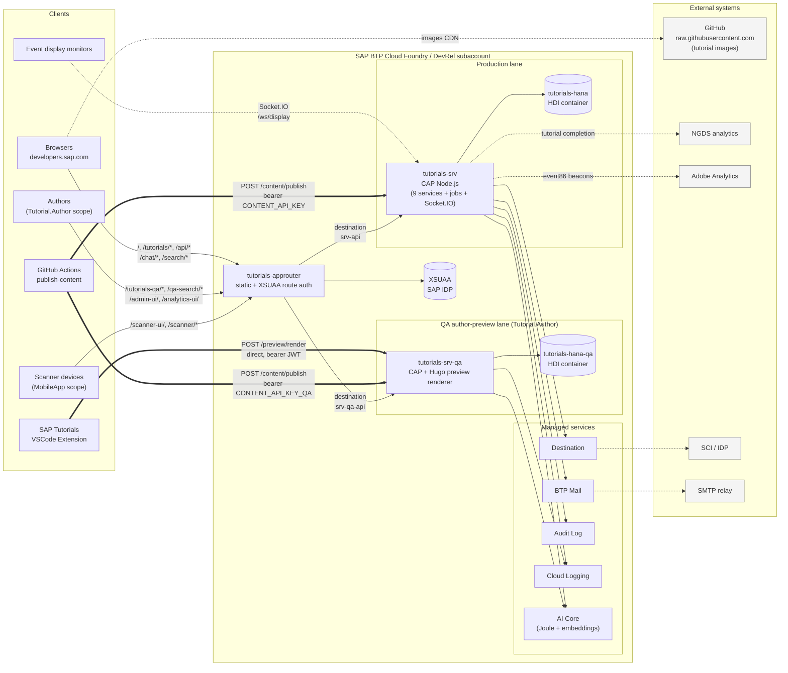

# Runtime Architecture
> Source: extracted from project README, 2026-05-25.

How traffic flows once the platform is deployed. Build-time data flow is in the next section.

**Notes:**

- **Approuter is the only XSUAA-protected entry point for browser traffic.** Each route declares its scope (`MobileApp`, `Admin`, `DisplayApp`, `ConsolidationScope`, `Tutorial.Author`) — see [approuter/xs-app.json](approuter/xs-app.json). Public routes (`/build/*`, `/feedback/*`, `/health`, `/.well-known/*`, `/ord/*`, `/content/*`, `/tutorials/*`) bypass auth.
- **Display monitors** connect via Socket.IO directly to `tutorials-srv` (`/ws/display` namespace, approuter route `^/socket\.io/` with `authenticationType: 'none'`); the `DisplayApp` scope check happens at the CAP WebSocket plugin layer when joining the namespace.
- **VSCode Author Preview** posts raw markdown to `tutorials-srv-qa`'s `POST /preview/render` directly with its own JWT — no approuter route wired (see [docs/superpowers/specs/2026-05-23-vscode-author-preview-design.md](docs/superpowers/specs/2026-05-23-vscode-author-preview-design.md)).
- **Two HDI containers** isolate prod and QA author content. `db/` deploys to `tutorials-hana`; `db-qa/` deploys to `tutorials-hana-qa`. Schemas drift-checked by `.github/workflows/schema-drift-check.yml`.
- **Tutorial HTML lives in HANA**, not static files — `tutorials-approuter` rewrites `/tutorials/*` to `/content/tutorials/*` on the CAP srv, which decompresses gzipped BLOBs from `ContentFiles`.
